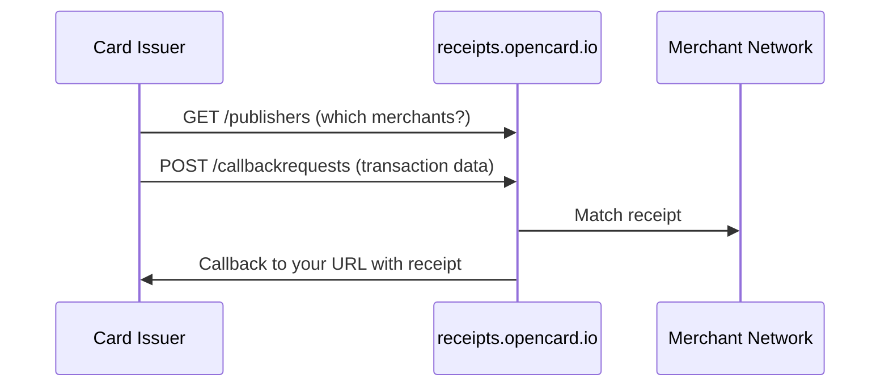

Payment providers and card issuers use this API to **request digital receipt matching** from OpenCard's merchant network.

<Warning>
  This is **not** the EMS API (`api.opencard.io`) and **not** the receipt provider callback. Card issuers use this API solely to **fetch digital receipts** for cardholders.
</Warning>

## Base URL

```
https://receipts.opencard.io
```

## How it works



## Auth

Bearer JWT. Contact **support@opencard.io** for credentials.

## Key endpoints

| Method | Path | Purpose |
|--------|------|---------|
| `GET` | `/api/v1/marcet/publishers` | List merchants with digital receipts |
| `POST` | `/api/v1/marcet/callbackrequests` | Submit transaction for matching |
| `PUT` | `/api/v1/marcet/callbackrequests/{id}` | Update (e.g. mark cleared) |
| `DELETE` | `/api/v1/marcet/callbackrequests/{id}` | Cancel request |

Full guide → [Digital Receipts for Issuers](/card-issuers/digital-receipts)
