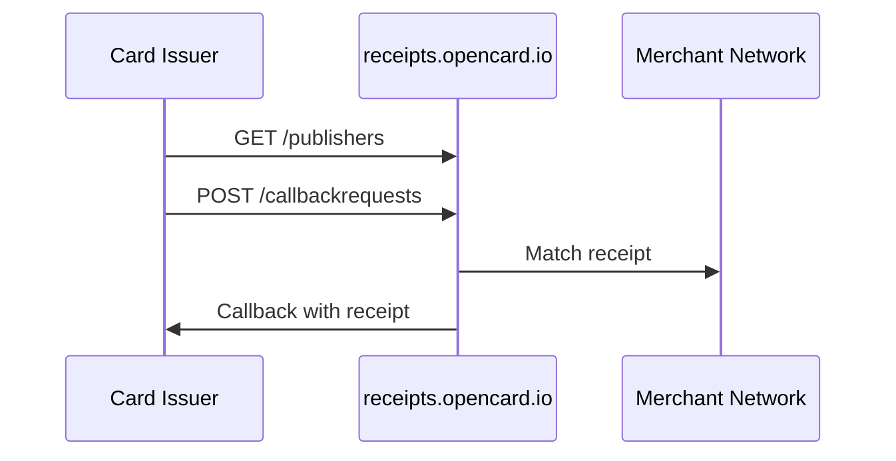

Give your cardholders **digital receipts** from merchants in OpenCard's network — matched to card transactions and delivered to your callback URL.

This is a **separate product** from the [Issuer transaction API](/card-issuers/issuer-integration) on `api.opencard.io`. Different host, credentials, and use case. You can run one or both.

---

## What you get

| Step | What happens |
|------|----------------|
| 1. Discover | List merchants (publishers) with active digital receipts and their CAIDs |
| 2. Submit | POST transaction data for matching |
| 3. Receive | OpenCard calls your callback when a receipt is found |

**Host:** `receipts.opencard.io`  
**Auth:** Bearer JWT (provided at onboarding)

---

## How it fits

---

## Guides

| Guide | What it covers |
|-------|----------------|
| [Integration guide](/card-issuers/digital-receipts/integration) | Step-by-step: publishers, callback requests, clearing |
| [Digital Receipts API](/api-reference/receipts/overview) | Full endpoint reference |

Contact **support@opencard.io** for JWT credentials and callback setup.
