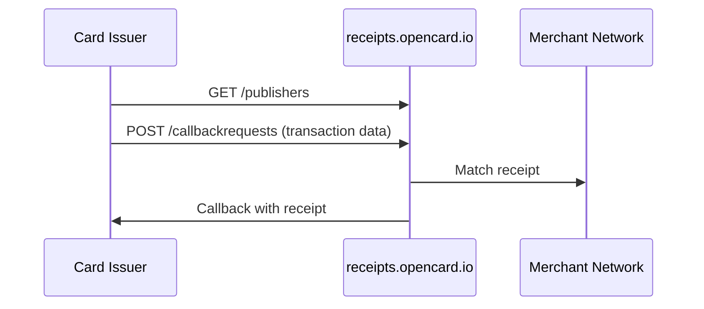

This section is for **card issuers** — banks and card programs that want to give cardholders **digital receipts** from OpenCard's merchant network.

If you're an EMS → [Quickstart](/getting-started/quickstart) instead.

---

## What you get

One API on **`receipts.opencard.io`**:

1. Discover which merchants have digital receipts (`GET /publishers`)
2. Submit card transactions for matching (`POST /callbackrequests`)
3. Receive matched receipts on your callback URL

No separate transaction-delivery API in these docs — that's handled outside this integration.

---

## How it works

---

## Get started

1. Contact **support@opencard.io** for JWT credentials and callback setup
2. Read the integration guide → [Digital Receipts](/card-issuers/digital-receipts)
3. API reference → [Digital Receipts API](/api-reference/receipts/overview)
