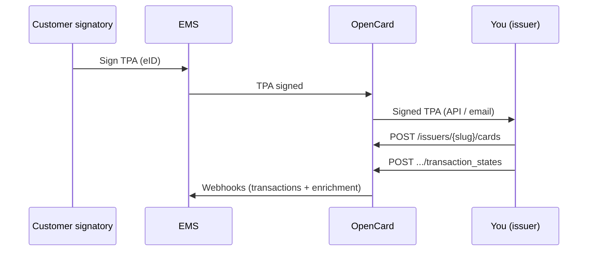

The **Issuer API** lets card issuers integrate directly with OpenCard and distribute transaction data to connected Expense Management Systems (EMS).

In addition to standard transaction data, OpenCard can attach **enriched information** — digital receipts, correct VAT, line items, environmental metrics — through partner networks. EMS users get a fuller picture of each purchase without you building that layer yourself.

<Note>
  This is **not** the digital receipts API on `receipts.opencard.io`. That is a separate product for receipt matching only. See [Digital receipts](/card-issuers/digital-receipts) if you need it.
</Note>

---

## End-to-end flow



---

## API surface

All endpoints live under:

```
{base_url}/api/v1/issuers/{slug}/
```

Replace `{slug}` with the value OpenCard assigns your integration.

| Area | Methods | Purpose |
|------|---------|---------|
| **Cards** | `POST` create, `PUT` update, `GET` one, `GET` list, `DELETE` close | Register, maintain, and inspect the card registry |
| **Transaction states** | `POST .../transaction_states` | Deliver transaction lifecycle events |

---

## Guides

| Guide | What it covers |
|-------|----------------|
| [Onboarding](/card-issuers/issuer-integration/onboarding) | TPA handoff and when to start sending data |
| [Authentication](/card-issuers/issuer-integration/authentication) | OAuth client credentials and scopes |
| [Cards](/card-issuers/issuer-integration/cards) | Create, update, list, and delete cards |
| [Transaction states](/card-issuers/issuer-integration/transaction-states) | Push purchases through their lifecycle |
| [TPA delivery](/card-issuers/issuer-integration/tpa-integration) | How OpenCard delivers signed / terminated TPAs to you (email or API) |

API reference → [Issuer API](/api-reference/issuers/overview)

---

## Environments

| | Sandbox | Production |
|---|---------|------------|
| **Base URL** | `https://sandbox-api.opencard.io` | `https://api.opencard.io` |
| **OAuth token** | `POST {base_url}/oauth/token` | Same path |

Contact **support@opencard.io** to start integration and receive sandbox credentials.
