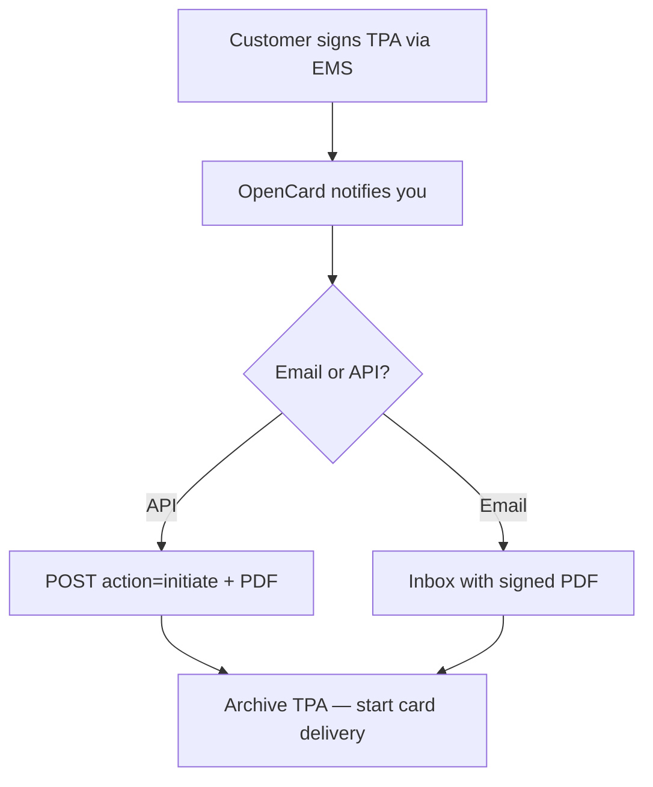

Integration starts when a **customer** (your corporate card client) authorises card data to flow through OpenCard to their EMS.

---

## 1. Customer signs the TPA

The customer's authorized signatories sign a **Transaction Processing Authorisation (TPA)** digitally via their EMS. The TPA states that the customer authorises **you** (the issuer) to release their card transactions to OpenCard for delivery to that EMS.

You do not run the signing flow — the EMS and OpenCard handle it.

---

## 2. You receive the signed TPA

When signing is complete, OpenCard notifies you via **API callback** and/or **email** (configured for your integration). On API, you receive an `initiate` payload with the signed PDF and the `payment_product` code the customer signed for — archive the PDF, enable **only that payment product** for the customer, then start sending cards and transactions.

Full contract (initiate + terminate) → [TPA delivery](/card-issuers/issuer-integration/tpa-integration)

---

## 3. Register cards

Create cards with `POST /api/v1/issuers/{slug}/cards` for each card that should flow through OpenCard. Every card carries the `payment_product` code it belongs to — OpenCard uses it to link the card to the TPA the customer signed.

The card registry is the foundation for transaction routing — every `transaction_states` call references a `{card_id}` you registered earlier.

→ [Cards](/card-issuers/issuer-integration/cards)

---

## 4. Push transaction states

Send all lifecycle states for each purchase:

- `authorized` — purchase just happened
- `cleared` — settled
- `invoiced` — included on issuer invoice (with `invoice_number` when applicable)
- `deleted` — authorization reversed

→ [Transaction states](/card-issuers/issuer-integration/transaction-states)

---

## Get credentials

Contact **support@opencard.io** with:

- Your legal name
- Expected markets (SE, NO, DK, FI)
- Technical contact for OAuth credentials and `{slug}` assignment
