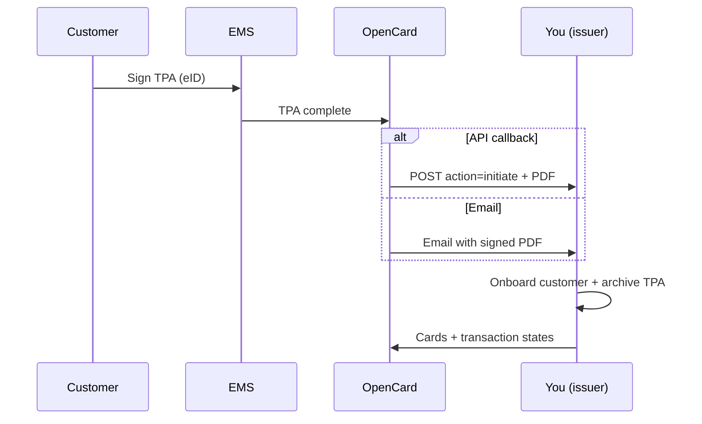

When a customer finishes signing a **Transaction Processing Authorisation (TPA)** in their EMS, OpenCard notifies **you** (the issuer) so you can start delivering cards and transactions for that company.

The same path is used when the customer **terminates** the connection from the EMS — you stop processing for that party.

---

## Delivery options

OpenCard can notify you in either (or both) of these ways — configured when your integration is set up:

| Channel | What you get |
|---------|----------------|
| **Email** | Signed TPA PDF + party details to your operations inbox |
| **API** | `POST` to an HTTPS endpoint **you** provide |

This page describes the **API** contract. Email is the same information packaged for humans.



→ Signing flow on the EMS side: [Issuer onboarding](/card-issuers/issuer-integration/onboarding)

---

## Your callback endpoint

You give OpenCard a URL. OpenCard calls it for both **initiate** and **terminate**.

| | |
|---|---|
| **Method** | `POST` |
| **Content-Type** | `application/json` |
| **Auth** | Whatever you require — agreed at onboarding (e.g. Bearer token, mutual TLS, HMAC header) |
| **Success** | `200` when processing is accepted or completed |
| **Client error** | `4xx` with a clear body (validation / reject) |
| **Temporary failure** | `5xx` — OpenCard may retry |

When this endpoint receives a valid **`initiate`** event, you should:

1. **Initialize** the customer for OpenCard card and transaction delivery
2. **Archive** the signed TPA PDF as legal evidence
3. Return **`200`** when accepted/completed — otherwise a clear **`4xx`** / **`5xx`**

When you receive **`terminate`**, stop card/transaction delivery for that party and archive the decision according to your process.

---

## `initiate` — TPA signed

Sent after all required signatories have signed. Includes the signed PDF as Base64.

```json
{
  "action": "initiate",
  "party_information": {
    "id": 6011,
    "name": "Open API Int. AB",
    "country": "SE",
    "organization_number": "559395-8076",
    "validate_signatures": false,
    "processing_setup": {
      "authorized": "When they occur",
      "cleared": "Not invoiced yet - First not invoiced transaction",
      "invoiced": "Invoiced - Next ordinary invoice date"
    }
  },
  "system": {
    "name_legal": "KwickExpense AB",
    "name_system": "KwickExpense",
    "signatories": [
      { "name": "Magne, Johan Olof" },
      { "name": "McKenzie, Marc Andreas" }
    ]
  },
  "document": {
    "file_name": "TPA_20260414_OpenAPIInt.AB.pdf",
    "mime_type": "application/pdf",
    "content_base64": "<base64-pdf>"
  }
}
```

### Field reference

| Field | Meaning |
|-------|---------|
| `action` | Always `initiate` for a new signed TPA |
| `party_information.id` | OpenCard party / TPA-side identifier for this customer |
| `party_information.name` | Legal / display name of the customer company |
| `party_information.country` | ISO country (e.g. `SE`) |
| `party_information.organization_number` | Company registration number |
| `party_information.validate_signatures` | Whether OpenCard expects you to treat signature validation as required on your side |
| `party_information.processing_setup` | How transaction states should be produced for this customer (`authorized` / `cleared` / `invoiced`) |
| `system.name_legal` | Legal name of the EMS that onboarded the customer |
| `system.name_system` | System / brand name of that EMS |
| `system.signatories` | People who signed the TPA |
| `document.file_name` | Suggested filename for the archived PDF |
| `document.mime_type` | Always `application/pdf` |
| `document.content_base64` | Full signed TPA PDF, Base64-encoded |

Decode `content_base64` and store the PDF. Use `party_information.id` (and org number) as the key when you later push [cards](/card-issuers/issuer-integration/cards) and [transaction states](/card-issuers/issuer-integration/transaction-states).

---

## `terminate` — connection ended

Sent when the customer ends the OpenCard connection in their EMS (or OpenCard terminates on their behalf). Same endpoint, smaller payload — **no PDF**.

```json
{
  "action": "terminate",
  "party_information": {
    "id": 6011,
    "name": "Open API Int. AB",
    "country": "SE",
    "organization_number": "559395-8076"
  },
  "system": {
    "name_legal": "KwickExpense AB",
    "name_system": "KwickExpense"
  }
}
```

| Field | Meaning |
|-------|---------|
| `action` | Always `terminate` |
| `party_information.*` | Same customer identity as on initiate — stop delivery for this party |
| `system.*` | Which EMS the customer used |

---

## Response expectations

| HTTP | When |
|------|------|
| `200` | You accepted the event (customer initialized / terminated, PDF archived if initiate) |
| `4xx` | Bad payload, unknown party, business reject — include a readable error message |
| `5xx` | Temporary failure — safe for OpenCard to retry |

Idempotency tip: treat repeated `initiate` / `terminate` for the same `party_information.id` as safe no-ops once already applied.

---

## After initiate

1. Register cards for the customer → [Cards](/card-issuers/issuer-integration/cards)
2. Push lifecycle states → [Transaction states](/card-issuers/issuer-integration/transaction-states)
3. Confirm TPA activation behaviour → [Onboarding](/card-issuers/issuer-integration/onboarding)

To wire the callback URL and auth scheme, contact **support@opencard.io**.
