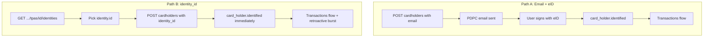

A **card holder** = one person in one organization whose card transactions you want in your EMS.

There are **two ways** to create them. This is one of the most important decisions in your integration — pick based on whether the person already exists in OpenCard or not.

---

## At a glance

| | 🅰️ Email + eID | 🅱️ `identity_id` (instant) |
|---|----------------|---------------------------|
| **Best for** | New employees, self-service | Person already known to OpenCard |
| **You provide** | `email` | `identity_id` (from identities API) |
| **User action** | Click email → sign PDPC with eID | None — instant |
| **Transactions start** | After user completes eID | **Immediately** on create |
| **Retroactive txs** | Yes, after eID sign | Yes, dispatched on create |
| **Typical UX** | "Check your email to activate" | Bulk import from employee list |



---

## Path 🅰️ — Email + eID (self-service)

Use when the person **doesn't exist in OpenCard yet** — typical for new employees joining a client.

### Create

```
POST /accounts/{accountId}/organizations/{organizationId}/cardholders
Scope: card-holders-write
```

```json
{
  "reference_id": "employee_john_42",
  "email": "john@acme.se",
  "language": "sv"
}
```

| Field | Required | Notes |
|-------|----------|-------|
| `reference_id` | ✅ | Your internal user ID |
| `email` | ✅ | Where PDPC signing link is sent |
| `language` | ❌ | PDPC legal text: `sv`, `no`, `da`, `en`, `fi` |
| `skip_pdpc_email` | ❌ | Default `false` — email is sent |

### What happens

1. Card holder + PDPC record created
2. 📧 **Email queued** — subject: `We need your approval.`
3. Link: `https://{env}/accounts/{accountId}/pdpcs/{pdpcId}/sign/{token}`
4. User reads PDPC → checks consent → identifies with **eID**
5. On eID success → identity linked → `card_holder.identified` webhook
6. **Retroactive transactions** dispatched (everything since last card invoice)
7. New transactions flow in real time

### Timeline

```
You:     POST cardholder ─────────────────────────────────────────►
User:              receives email ──► signs PDPC/eID ──►
OpenCard:                                    identified ──► txs flow ⚡
```

<Tip>
  Subscribe to `card_holder.identified` — that's your signal that transactions are coming (including a retroactive batch). Don't wait for `card_holder.signed.pdpc` alone; identification is what unlocks the pipe.
</Tip>

Full eID details → [eID Signing](/ems/eid-signing) · PDPC details → [PDPC Flow](/ems/pdpc-flow)

---

## Path 🅱️ — `identity_id` (instant)

Use when the person **already exists in OpenCard** on this TPA — e.g. they have corporate cards from the issuer, or were onboarded to another organization under the same TPA.

An **identity** = a physical person (SSN-linked via eID). They may already have cards attached. You skip the email entirely and link directly.

### Step 1: List identities on the TPA

```
GET /accounts/{accountId}/tpas/{tpaId}/identities
Scope: account-tpa-identities-read
```

**Filter to people not yet in your org:**

```
GET .../identities?is_card_holder=false
```

| Query param | Values | Meaning |
|-------------|--------|---------|
| `is_card_holder` | `true` | Only identities that already have card holders |
| `is_card_holder` | `false` | Only identities **without** card holders — good for finding who you still need to onboard |
| *(omit)* | — | All identities on this TPA |

**Response (per identity):**

```json
{
  "id": 123,
  "name": "Anna Andersson",
  "employee_id": "001",
  "cards": [
    {
      "id": 10,
      "last_four": "1234",
      "token": "ext-card-id-abc",
      "type": "corporate"
    }
  ],
  "card_holders": [
    {
      "id": 22,
      "reference_id": "anna_other_org",
      "organizations": { "id": 3, "name": "Acme Corp" }
    }
  ]
}
```

| Field | What it tells you |
|-------|-------------------|
| `id` | **Use this as `identity_id`** when creating card holder |
| `name` | Person's name from eID |
| `employee_id` | Employee ID at client (if set) |
| `cards` | Cards already linked to this person on this TPA |
| `card_holders` | Existing card holder records (maybe in other orgs) |

### Step 2: Create card holder with `identity_id`

```json
{
  "reference_id": "employee_anna_07",
  "identity_id": 123,
  "skip_pdpc_email": true
}
```

| Field | Required | Notes |
|-------|----------|-------|
| `reference_id` | ✅ | Your internal user ID |
| `identity_id` | ✅ | From identities list. Must belong to same client as TPA. |
| `email` | ❌ | Not needed when `identity_id` is set |
| `skip_pdpc_email` | recommended `true` | Person already identified — no need for another email |

### What happens

1. Card holder created
2. **Immediately linked** to existing identity → `identify()` called
3. 🔔 `card_holder.identified` webhook fires **right away**
4. 🚀 `SendRetroactiveWebhookEventsJob` dispatched — **all historical transaction states** for their cards on this TPA are replayed to your webhook
5. New transactions flow in real time from this point

### Timeline

```
You:  GET identities ──► POST cardholder with identity_id ──► txs flow ⚡ (same second)
```

<Warning>
  The retroactive burst can be **large** — all transaction states since last invoice replay as webhooks. Make sure your handler can upsert by transaction `id` and handle the volume.
</Warning>

### Validation rules

- `identity_id` must exist
- Identity must belong to a **client linked to this TPA** — you can't use identities from a different client's TPA
- Either `email` or `identity_id` required (not both required, but one must be present)

---

## Which path should I use?

| Scenario | Path |
|----------|------|
| New hire, never used OpenCard | 🅰️ Email |
| Employee already has corp card via issuer | 🅱️ `identity_id` |
| Bulk onboarding 50 people who all have cards | 🅱️ `identity_id` |
| Re-adding person to a **new** organization under same TPA | 🅱️ `identity_id` |
| You want user to explicitly consent via email link | 🅰️ Email |
| Self-service "activate your card" flow in your app | 🅰️ Email |

---

## Webhooks to handle

| Event | Path 🅰️ | Path 🅱️ |
|-------|---------|---------|
| `card_holder.created` | ✅ on create | ✅ on create |
| `card_holder.identified` | ✅ after eID sign | ✅ **immediately** on create |
| `card_holder.signed.pdpc` | ✅ after eID sign | May not fire (already identified) |
| `card.transaction.*` | After identified | **Immediately** (+ retroactive batch) |

**Your integration should key off `card_holder.identified`** as the moment transactions are expected.

---

## Update / delete

```
GET    .../cardholders              ← list (includes identity name + employee_id)
PUT    .../cardholders/{cardHolderId}   ← resends PDPC email if unsigned
DELETE .../cardholders/{cardHolderId}  ← fires card_holder.deleted
```

---

## List card holders

```
GET /accounts/{accountId}/organizations/{organizationId}/cardholders
Scope: card-holders-read
```

Supports the same filters as before (`q`, `reference_id`, `where_ssn_set`, `where_signed_pdpc`, `where_email_delivered`).

**Response (per item):**

```json
{
  "id": 15,
  "reference_id": "employee_john_42",
  "organization_id": 3,
  "identity_id": 123,
  "email": "john@acme.se",
  "created_at": "2026-06-08T10:00:00.000000Z",
  "updated_at": "2026-06-08T10:30:00.000000Z",
  "meta": {
    "ssn": true,
    "signed": true,
    "signed_at": "2026-06-08T10:30:00.000000Z",
    "email_status": "delivered",
    "pdpc_url": "https://api.opencard.io/accounts/1/pdpcs/8/sign/abc...",
    "system": "Acme EMS",
    "organization_number": "5561234567"
  },
  "identity": {
    "name": "Anna Andersson",
    "employee_id": "001"
  }
}
```

| Field | What it tells you |
|-------|-------------------|
| `identity_id` | OpenCard identity ID when linked (null before eID sign on Path 🅰️) |
| `identity.name` | Person name from eID — use for display in your UI |
| `identity.employee_id` | Employee ID on the TPA client (if set on `client_identity`) |
| `identity` | `null` when not yet linked to an identity |

<Tip>
  You no longer need a separate `GET .../tpas/{tpaId}/identities` call just to show names in a card holder list — read `identity` from this endpoint. Keep the identities endpoint for Path 🅱️ onboarding (finding `identity_id` to create with).
</Tip>

---

## `meta` in API responses

Check consent status without polling webhooks:

```json
{
  "id": 7,
  "reference_id": "employee_john_42",
  "meta": {
    "ssn": true,
    "signed": true,
    "signed_at": "2026-06-08T10:30:00Z",
    "email_status": "delivered",
    "pdpc_url": "https://api.opencard.io/accounts/1/pdpcs/3/sign/abc...",
    "system": "Acme EMS",
    "organization_number": "5561234567"
  },
  "identity": {
    "name": "John Doe",
    "employee_id": "042"
  }
}
```
