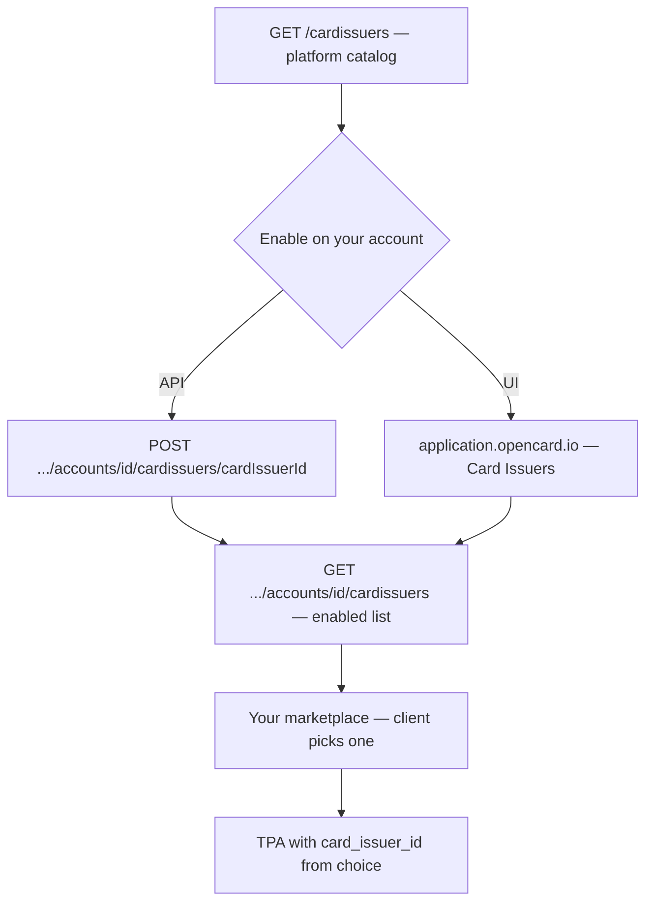

Client onboarding starts with **choosing a card program**. That only works if you have already decided **which issuers your EMS offers**. This is a **one-time account setup** — not part of the per-client wizard.

<Tip>
  Part of the full path → [Customer onboarding overview](/ems/customer-onboarding)
</Tip>



---

## 1. Discover available programs

```
GET /cardissuers
Scope: card-issuers-read
```

Returns every card program on the OpenCard platform. Your EMS account does **not** have them yet — this is the full catalog.

→ [List available issuers](/api-reference/ems/card-issuers/list-available-issuers)

---

## 2. Enable the ones you sell

Pick the programs you want in your product, then attach them to **your account**:

```
POST /accounts/{accountId}/cardissuers/{cardIssuerId}
Scope: account-card-issuers-write
```

You can do this via the API or in **[application.opencard.io](https://application.opencard.io)** under **Card Issuers** (enable / disable per program). Same result either way.

→ [Enable issuer](/api-reference/ems/card-issuers/enable-issuer) · [Quickstart](/getting-started/quickstart#step-2-enable-a-card-issuer)

---

## 3. Show enabled programs in your marketplace

When a **client** onboards, list only what you enabled:

```
GET /accounts/{accountId}/cardissuers
Scope: account-card-issuers-read
```

Build a marketplace (or wizard step) where the client picks one program. Store the chosen **`id`** — that becomes `card_issuer_id` when you create the TPA.

The optional [ocTPA plugin](/ems/plugins) renders the same step as product cards. Example — Nordea Business Card with Mastercard (fields from `GET .../cardissuers`):

<div className="oc-tpa-preview">
  <div className="oc-tpa-card">
    <div className="oc-tpa-card-header">
      <div>
        <div className="oc-tpa-card-title">Nordea Business Card</div>
        <div className="oc-tpa-card-subtitle">Corporate Card</div>
      </div>
      <div className="oc-tpa-card-logo-wrap">
        
      </div>
    </div>
    <p className="oc-tpa-card-desc">
      Corporate card with real-time transaction data, digital receipts, and expense enrichment via OpenCard.
    </p>
    <div className="oc-tpa-card-footer">
      <div className="oc-tpa-card-scheme-wrap">
        
      </div>
      <div className="oc-tpa-card-actions">
        <span className="oc-tpa-btn-outline">Info &amp; Pricing</span>
        <span className="oc-tpa-btn-primary">Activate</span>
      </div>
    </div>
  </div>
</div>

Fields the plugin maps from each enabled issuer:

| API field | Use in UI |
|-----------|-----------|
| `name_product` | Card title |
| `type_product` | Subtitle (e.g. Corporate Card, Credit Card) |
| `logo_url` | Issuer logo |
| `product_description_short` | Short description on the card |
| `card_scheme_logo_url` | Visa / Mastercard badge |
| `name_display` | Confirmation screen after selection |
| `product_description_long` | Longer copy on confirmation |
| `id` | **`card_issuer_id`** on `POST .../tpas` |

Filter by `name_system` if you only expose a subset (`allowedCardIssuerIds` in the plugin).

---

## Next step

Once issuers are enabled, each client picks one in Phase 1 and you create the TPA with that `card_issuer_id`.

→ [TPA flow](/ems/tpa-flow) · [Customer onboarding — Phase 1](/ems/customer-onboarding#phase-1--client-setup)
