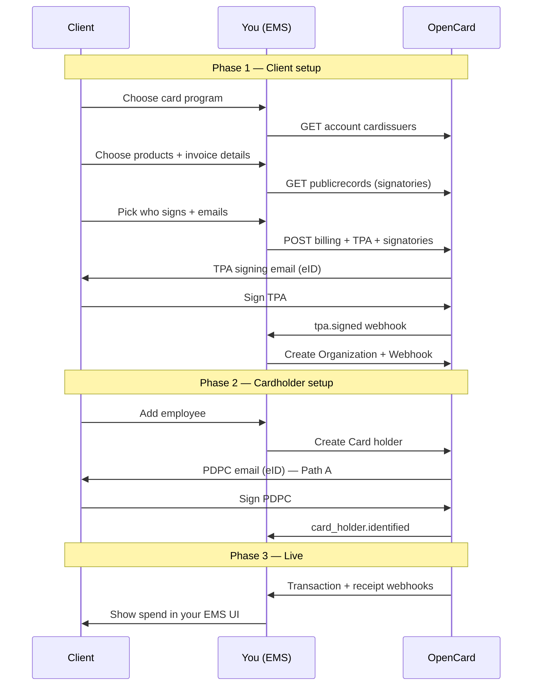
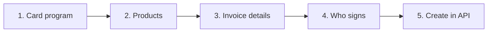

This is the **end-to-end path** for connecting one of your clients to OpenCard. Everything you need lives in the Application API — no embed plugin required. The guides below this page go deeper on TPA signing, eID, and card holders.

---

## Who does what

| Actor | Role |
|-------|------|
| **Client** | Your end-customer company — signs the TPA; their employees sign PDPC |
| **You (EMS)** | Orchestrate setup in your product — call OpenCard APIs, store `reference_id`s, show status in your UI |
| **OpenCard** | Legal signing (eID), card issuer communication, webhooks with transactions and enrichment |

You own the UX. OpenCard owns signing pages, identity verification, and data delivery.

---

## Big picture



---

## Phase 1 — Client setup

This is what the **client** walks through in your product (same order as the optional [ocTPA plugin](/ems/plugins)). You collect choices in the UI, then create the OpenCard resources.



### 1. Choose card program

```
GET /accounts/{accountId}/cardissuers
```

Show only issuers **already enabled** on your account. The client picks one → you store `card_issuer_id` for the TPA.

Enabling new issuers on the account is one-time platform setup — not part of this per-client wizard. → [Quickstart](/getting-started/quickstart)

### 2. Choose products

What OpenCard should deliver for this client. Collected on the **billing** profile when you create it:

| Product flag | Meaning | Typical UX |
|--------------|---------|------------|
| `product_transaction` | Real-time transaction states to your webhooks | Usually always on |
| `product_digital_receipt` | Digital receipts / enrichment from the merchant network | Optional toggle |
| `product_aland_index` | Environmental impact estimates on transactions | Optional toggle |

Transactions are the core product. Receipts and environmental impact are **enriched** add-ons — same model the plugin uses under “Transaction information” vs “Enriched information”.

→ [Billing](/ems/model/billing) · [Receipts](/ems/receipts) · [Environmental impact](/ems/environmental-impact)

### 3. Invoice details (for your OpenCard bill)

Collect how **you** (the EMS) want this client represented on the invoice OpenCard sends **you**:

- Invoice email (`email_invoice`)
- Your reference (`your_reference_invoice`)
- Legal name / org number / address (often from public records)

Organizations that share the same billing profile appear as **one line** on that invoice — not as separate invoices per organization. This is not the bank’s card invoice to the client.

→ [Billing](/ems/model/billing)

### 4. Who must approve (TPA signatories)

```
GET /accounts/{accountId}/publicrecords?country=SE&organization_number=...
```

Use `signature_combinations` when present so the client picks a valid signing group. Collect **name + email** for each required signatory (or allow manual entry when the registry has no combinations).

→ [TPA flow](/ems/tpa-flow) · [eID signing](/ems/eid-signing)

### 5. Create what they chose (your APIs)

When the client confirms, create everything in OpenCard:

```
POST /accounts/{accountId}/billings          ← invoice + product flags
POST /accounts/{accountId}/tpas             ← card_issuer_id + company
POST /accounts/{accountId}/tpas/{id}/signatories   ← emails → eID links
```

OpenCard emails signatories. They sign with national **eID**. You wait for status — do not build your own signing UI.

| Event / signal | Meaning |
|----------------|---------|
| Signatory signs | Progress toward fully signed |
| `tpa.signed` webhook | All required signatures done — PDF ready |
| Status → `activated` | TPA confirmed — transactions can flow |

Then create the **runtime** container:

```
POST /accounts/{accountId}/organizations    ← tpa_id + billing_id + your reference_id
POST /accounts/{accountId}/organizations/{id}/webhooks
```

Pass the webhook challenge before `active=true`.

```json
{
  "reference_id": "client_acme_001",
  "tpa_id": 42,
  "billing_id": 1,
  "name": "Acme AB"
}
```

→ [Organization](/ems/model/organization) · [Webhook setup](/ems/webhooks/setup) · [TPA flow](/ems/tpa-flow)

**Client setup is complete** when: TPA is signed (ideally activated), organization exists with `billing_id` + `tpa_id`, and webhook is active.
---

## Phase 2 — Cardholder setup

Goal: each person whose card spend you want is identified in OpenCard.

```
POST /accounts/{accountId}/organizations/{organizationId}/cardholders
```

| Path | You send | User action | Transactions start |
|------|----------|-------------|--------------------|
| 🅰️ Email | `email` | Signs PDPC with eID | After `card_holder.identified` |
| 🅱️ Instant | `identity_id` | None | Immediately |

OpenCard handles PDPC email + eID. You handle status in your UI (`card_holder.identified`, `card_holder.signed.pdpc`).

→ [Card holder onboarding](/ems/card-holders) · [Model: Card holder](/ems/model/card-holder) · [eID signing](/ems/eid-signing)

**Cardholder is onboarded** when you receive `card_holder.identified` — then expect transactions (including a retroactive batch).

---

## Phase 3 — Live

Once card holders are identified and the TPA is activated:

1. Card issuer pushes transaction states to OpenCard
2. OpenCard POSTs to your organization webhook (`card.transaction.*`)
3. Enrichment may follow: `receipt.fetched`, true VAT, line items, environmental impact

→ [Transaction states](/ems/webhooks/transactions) · [Events](/ems/webhooks/events) · [Receipts](/ems/receipts)

---

## Ordered checklist

Do this **per client** (after your account + OAuth client exist):

| # | Step | API / action | Detail guide |
|---|------|--------------|--------------|
| 0 | Enable card issuer(s) on account (once) | `POST .../cardissuers/{id}` | [Quickstart](/getting-started/quickstart) |
| 1 | Client picks card program | `GET .../accounts/{id}/cardissuers` | below |
| 2 | Client picks products | Flags on billing create | [Billing](/ems/model/billing) |
| 3 | Invoice email / reference | Part of billing create | [Billing](/ems/model/billing) |
| 4 | Who signs | `GET .../publicrecords` | [TPA flow](/ems/tpa-flow) |
| 5 | Create billing + TPA + signatories | `POST` billings, tpas, signatories | [TPA flow](/ems/tpa-flow) |
| 6 | Wait for eID + `tpa.signed` | Webhook / status | [eID signing](/ems/eid-signing) |
| 7 | Create organization + webhook | `POST` orgs, webhooks | [Organization](/ems/model/organization) · [Webhooks](/ems/webhooks/setup) |
| 8 | Create card holders | `POST` cardholders | [Card holders](/ems/card-holders) |
| 9 | Wait for `card_holder.identified` | Webhook | [Card holders](/ems/card-holders) |
| 10 | Handle transactions + enrichment | Webhooks | [Transactions](/ems/webhooks/transactions) |

---

## Build it yourself vs embed plugin

| Approach | When |
|----------|------|
| **API only (this guide)** | Rebuild the same steps in your own UI — recommended for production |
| **[ocTPA plugin](/ems/plugins)** | Ready-made wizard: issuer → products → invoice → signatories; **you still POST** billing / TPA / signatories from `onDataSend` |

The plugin mirrors steps 1–5 above. It does not create organization, webhook, or card holders — those stay in your integration.

---

## Deep dives in this section

| Page | What it covers |
|------|----------------|
| [TPA flow](/ems/tpa-flow) | Create TPA, signatories, activation, signed PDF |
| [eID signing](/ems/eid-signing) | Sign vs auth modes across Nordic countries |
| [Card holder onboarding](/ems/card-holders) | Email vs `identity_id`, webhooks, updates |

**Models** (what each entity is): [Billing](/ems/model/billing) · [Organization](/ems/model/organization) · [TPA](/ems/model/tpa) · [Card holder](/ems/model/card-holder)
