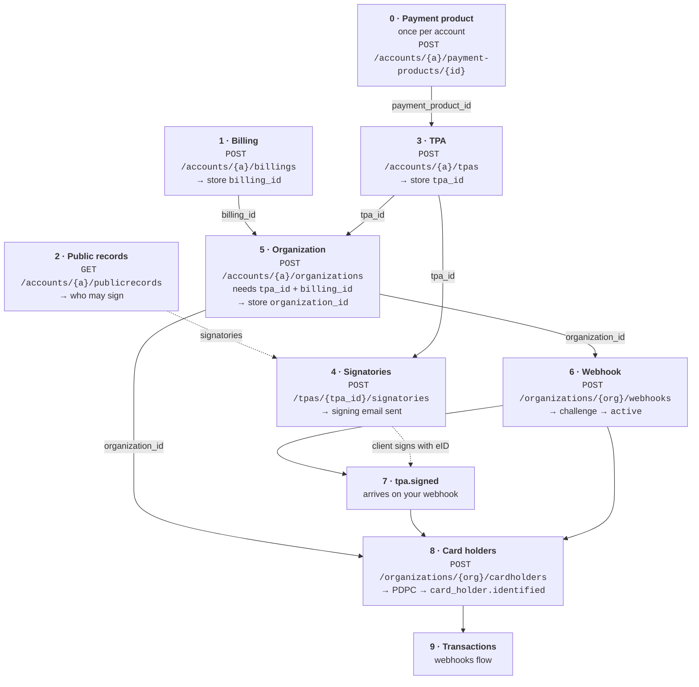

This is the **end-to-end path** for connecting one of your clients to OpenCard. Everything lives in the Application API — no embed plugin required.

If you just want to run it once with curl, start with the [Quickstart](/getting-started/quickstart). This page is the same flow written as an integration guide: what to build in your product, which call to make, what to store, and what breaks if a step is skipped.

---

## Who does what

| Actor | Role |
|-------|------|
| **Client** | Your end-customer company — signs the TPA; their employees sign PDPC |
| **You (EMS)** | Orchestrate setup in your product — call OpenCard APIs, store ids and `reference_id`s, show status in your UI |
| **OpenCard** | Legal signing (eID), card issuer communication, webhooks with transactions and enrichment |

You own the UX. OpenCard owns signing pages, identity verification, and data delivery.

---

## The order matters

Each object references the one before it. Create them in this order and store the id you get back.

Solid arrows are hard dependencies (the call fails or misbehaves without the id). Dotted arrows are information flow.

---

## Step by step

Steps 0 is once per account. Steps 1–8 are repeated **per client**.

<Steps>
  <Step title="Enable a payment product (once per account)">
    Pick which card products your clients can choose from and enable them on your account.

    `GET /payment-products` → `POST /accounts/{accountId}/payment-products/{paymentProductId}`

    **Store:** `payment_product_id` — used on the TPA.

    → [Payment product setup](/ems/payment-products-setup) · API: [List available](/api-reference/ems/payment-products/list-available-payment-products) · [Enable](/api-reference/ems/payment-products/enable-payment-product)
  </Step>

  <Step title="Create the billing profile">
    The client's invoice profile **and** the product switch. `product_transaction`, `product_digital_receipt` and `product_aland_index` decide which webhook events the client's organizations may subscribe to.

    `POST /accounts/{accountId}/billings`

    **Store:** `id` as `billing_id`.

    **If skipped:** the organization has no `billing_id`, and creating a webhook with transaction or receipt events fails — the webhook is validated against the billing's product flags.

    → [Organization setup](/ems/organization-setup) · [Model: Billing](/ems/model/billing) · API: [Create billing profile](/api-reference/ems/billings/create-billing-profile)
  </Step>

  <Step title="Look up who may sign (recommended)">
    Ask the public registry for the company's signing combinations so you can present the right signatories to the client.

    `GET /accounts/{accountId}/publicrecords?country=SE&organization_number=…`

    → [TPA flow — check who can sign](/ems/tpa-flow#step-2-check-who-can-sign-recommended) · API: [Lookup company signing combinations](/api-reference/ems/public-records/lookup-company-signing-combinations)
  </Step>

  <Step title="Create the TPA">
    The legal agreement between the client and the card issuer that allows transaction data to flow.

    `POST /accounts/{accountId}/tpas` with `payment_product_id`, `country`, `organization_number`, `language`

    **Store:** `id` as `tpa_id`.

    → [TPA flow](/ems/tpa-flow) · [Model: TPA](/ems/model/tpa) · API: [Create TPA](/api-reference/ems/tpas/create-tpa)
  </Step>

  <Step title="Add signatories — signing email goes out">
    One call per person who must sign. The email with the eID signing link is queued immediately.

    `POST /accounts/{accountId}/tpas/{tpaId}/signatories`

    Don't wait for the signature — continue with steps 5 and 6 right away so the webhook exists when `tpa.signed` fires.

    → [TPA flow — signatories](/ems/tpa-flow) · API: [Add signatory](/api-reference/ems/tpa-signatories/add-signatory-sends-email)
  </Step>

  <Step title="Create the organization">
    The runtime container for the client. Links the TPA (legal) and the billing (products) together, and carries your `reference_id` into every webhook.

    `POST /accounts/{accountId}/organizations` with `reference_id`, `tpa_id`, `billing_id`

    **Store:** `id` as `organization_id`.

    **If `billing_id` is skipped:** webhook creation with transaction events fails (see step 1).

    → [Organization setup](/ems/organization-setup) · [Model: Organization](/ems/model/organization) · API: [Create organization](/api-reference/ems/organizations/create-organization)
  </Step>

  <Step title="Create the webhook">
    Where OpenCard delivers events. Creation triggers a challenge request to your URL; once your endpoint answers correctly the webhook becomes `active`.

    `POST /accounts/{accountId}/organizations/{organizationId}/webhooks` with `url` + event flags

    **Verify:** `active: true` on `GET .../webhooks`.

    **If skipped:** card holder lifecycle and PDPC signing write events to the organization's webhook — without one, PDPC signing cannot complete. This is the single most common onboarding mistake.

    → [Organization setup](/ems/organization-setup) · [Webhook setup](/ems/webhooks/setup) · [Events](/ems/webhooks/events) · API: [Create webhook](/api-reference/ems/webhooks/create-webhook)
  </Step>

  <Step title="Wait for tpa.signed">
    The client's signatories sign with eID. When all required signatures are in, OpenCard generates the signed PDF and POSTs `tpa.signed` to your webhook — your first real event for this client.

    The TPA moves to `pending-activation` and then `activated`. Card holders can be created before activation, but transactions only flow once the TPA is activated.

    → [eID signing](/ems/eid-signing) · [TPA lifecycle](/ems/tpa-flow#tpa-lifecycle-states) · API: [Get TPA](/api-reference/ems/tpas/get-tpa)
  </Step>

  <Step title="Create card holders">
    One per employee. **Email path** sends a PDPC consent + eID; **instant path** links an existing `identity_id` with no user action.

    `POST /accounts/{accountId}/organizations/{organizationId}/cardholders`

    **Verify:** `card_holder.identified` arrives on your webhook. That is the signal that transactions are coming (including a retroactive batch).

    → [Card holder onboarding](/ems/card-holders) · [Model: Card holder](/ems/model/card-holder) · API: [Create card holder](/api-reference/ems/card-holders/create-card-holder) · [List identities on TPA](/api-reference/ems/identities/list-identities-on-tpa)
  </Step>
</Steps>

After that you are live: the card issuer pushes transaction states → OpenCard POSTs to your webhook → enrichment may follow. → [Transaction states](/ems/webhooks/transactions) · [Receipts](/ems/receipts)

---

## Pre-flight check per client

Before you add the first card holder for a client, all of these must be true:

- [ ] Billing exists with the right `product_*` flags, and the organization's `billing_id` points to it
- [ ] TPA exists and the organization's `tpa_id` points to it
- [ ] Organization exists with your `reference_id`
- [ ] Webhook exists under the organization and is `active`
- [ ] TPA is `signed` (and `activated` for live transactions)

Then, and only then: card holders.

---

## Build it yourself vs embed plugin

| Approach | When |
|----------|------|
| **API only (this guide)** | Rebuild the steps in your own UI — recommended for production |
| **[ocTPA plugin](/ems/plugins)** | Ready-made wizard for steps 1–4 (payment product → products → invoice → signatories). Hands you the payload in `onDataSend`; **you still POST** billing, TPA and signatories |

<Warning>
  The plugin stops at the TPA. Organization (step 5), webhook (step 6) and card holders (step 8) are always your integration's responsibility — there is nothing in the plugin payload for them, because the webhook URL is *your* endpoint, not client input.
</Warning>

---

## Deep dives in this section

| Page | What it covers |
|------|----------------|
| [Payment product setup](/ems/payment-products-setup) | Enable products, marketplace UI, `payment_product_id` |
| [TPA flow](/ems/tpa-flow) | Create TPA, signatories, activation, signed PDF |
| [Organization setup](/ems/organization-setup) | Billing, organization, webhook — the three calls every client needs before card holders |
| [eID signing](/ems/eid-signing) | Sign vs auth modes across Nordic countries |
| [Card holder onboarding](/ems/card-holders) | Email vs `identity_id`, webhooks, updates |

**Models:** [Billing](/ems/model/billing) · [Organization](/ems/model/organization) · [TPA](/ems/model/tpa) · [Card holder](/ems/model/card-holder)
