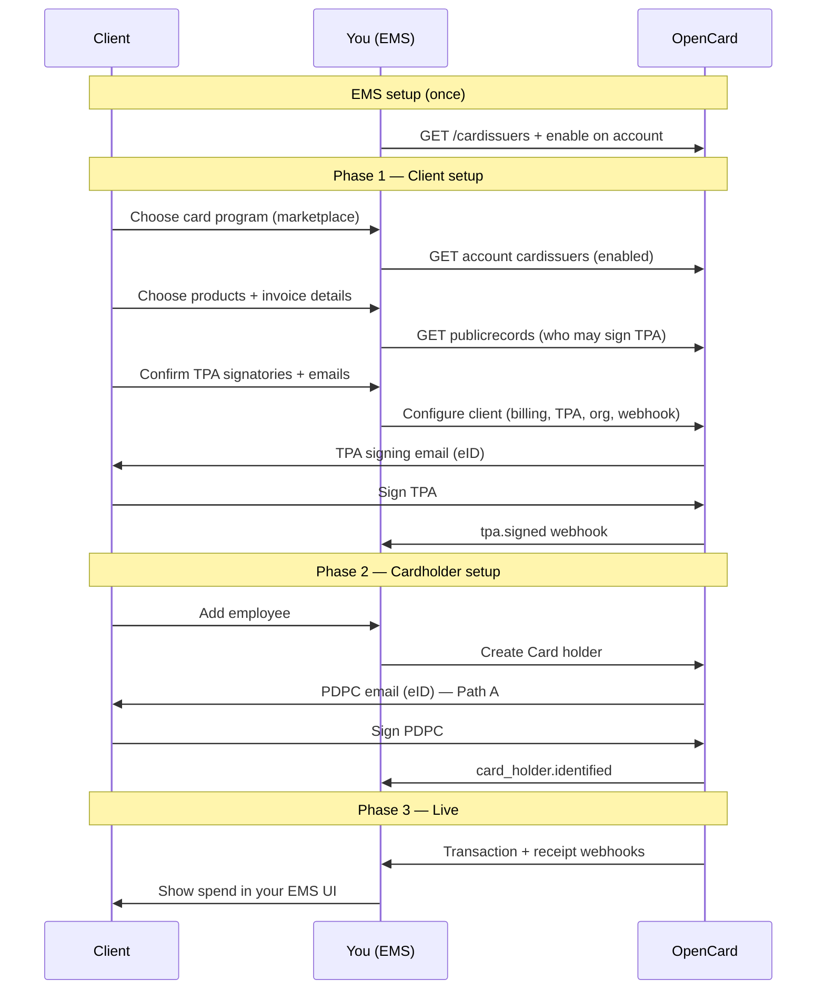

This is the **end-to-end path** for connecting one of your clients to OpenCard. Everything you need lives in the Application API — no embed plugin required.

Each major step has its own guide — same pattern as [TPA flow](/ems/tpa-flow) and [Card holders](/ems/card-holders):

| Guide | When |
|-------|------|
| [Card issuer setup](/ems/card-issuers-setup) | Once per EMS account — enable programs before any client onboards |
| [TPA flow](/ems/tpa-flow) | Per client — legal authorisation + signatories |
| [Card holders](/ems/card-holders) | Per employee — PDPC consent or instant match |
| [eID signing](/ems/eid-signing) | Reference for Nordic signing modes |

---

## Who does what

| Actor | Role |
|-------|------|
| **Client** | Your end-customer company — signs the TPA; their employees sign PDPC |
| **You (EMS)** | Orchestrate setup in your product — call OpenCard APIs, store `reference_id`s, show status in your UI |
| **OpenCard** | Legal signing (eID), card issuer communication, webhooks with transactions and enrichment |

You own the UX. OpenCard owns signing pages, identity verification, and data delivery.

---

## Big picture

---

## Phase 1 — Client setup

The client walks through your product: **card program → products → invoice details → TPA signatories**. You then create billing, TPA, organization, and webhook via the API (or receive the payload from the [ocTPA plugin](/ems/plugins) and POST it yourself).

Complete when the TPA is signed (ideally activated), the organization exists with `billing_id` + `tpa_id`, and the webhook is active.

→ [Card issuer setup](/ems/card-issuers-setup) · [TPA flow](/ems/tpa-flow) · [Billing](/ems/model/billing) · [Webhooks](/ems/webhooks/setup)

---

## Phase 2 — Cardholder setup

Add each employee as a card holder. **Email path** sends PDPC + eID; **instant path** matches on `identity_id` with no user action.

Complete when you receive `card_holder.identified` — then expect transactions (including a retroactive batch).

→ [Card holder onboarding](/ems/card-holders) · [Model: Card holder](/ems/model/card-holder)

---

## Phase 3 — Live

Card issuer pushes transaction states → OpenCard POSTs to your webhook → enrichment may follow (receipts, VAT, line items, environmental impact).

→ [Transaction states](/ems/webhooks/transactions) · [Events](/ems/webhooks/events) · [Receipts](/ems/receipts)

---

## Ordered checklist

Do this **per client** (after your account + OAuth client exist):

| # | Step | API / action | Detail guide |
|---|------|--------------|--------------|
| 0 | Enable card issuer(s) on account (once) | `GET /cardissuers` → `POST .../accounts/{id}/cardissuers/{id}` (or [application.opencard.io](https://application.opencard.io)) | [Card issuer setup](/ems/card-issuers-setup) |
| 1 | Client picks card program | `GET .../accounts/{id}/cardissuers` → `card_issuer_id` on TPA | [Card issuer setup](/ems/card-issuers-setup) |
| 2 | Client picks products | Flags on billing create | [Billing](/ems/model/billing) |
| 3 | Invoice email / reference | Part of billing create | [Billing](/ems/model/billing) |
| 4 | Create TPA (who signs) | `GET` publicrecords — collect signatories | [TPA flow](/ems/tpa-flow) |
| 5 | Configure client | `POST` billings, tpas, signatories, orgs, webhooks | [TPA flow](/ems/tpa-flow) · [Webhooks](/ems/webhooks/setup) |
| 6 | Wait for eID + `tpa.signed` | Webhook / status | [eID signing](/ems/eid-signing) |
| 7 | Create card holders | `POST` cardholders | [Card holders](/ems/card-holders) |
| 8 | Wait for `card_holder.identified` | Webhook | [Card holders](/ems/card-holders) |
| 9 | Handle transactions + enrichment | Webhooks | [Transactions](/ems/webhooks/transactions) |

---

## Build it yourself vs embed plugin

| Approach | When |
|----------|------|
| **API only (this guide)** | Rebuild the same steps in your own UI — recommended for production |
| **[ocTPA plugin](/ems/plugins)** | Ready-made wizard: issuer → products → invoice → signatories; **you still POST** billing / TPA / signatories from `onDataSend` |

The plugin mirrors Phase 1 in the UI. Organization + webhook and card holders stay in your integration.

---

## Deep dives in this section

| Page | What it covers |
|------|----------------|
| [Card issuer setup](/ems/card-issuers-setup) | Enable programs, marketplace UI, `card_issuer_id` |
| [TPA flow](/ems/tpa-flow) | Create TPA, signatories, activation, signed PDF |
| [eID signing](/ems/eid-signing) | Sign vs auth modes across Nordic countries |
| [Card holder onboarding](/ems/card-holders) | Email vs `identity_id`, webhooks, updates |

**Models** (what each entity is): [Billing](/ems/model/billing) · [Organization](/ems/model/organization) · [TPA](/ems/model/tpa) · [Card holder](/ems/model/card-holder)
