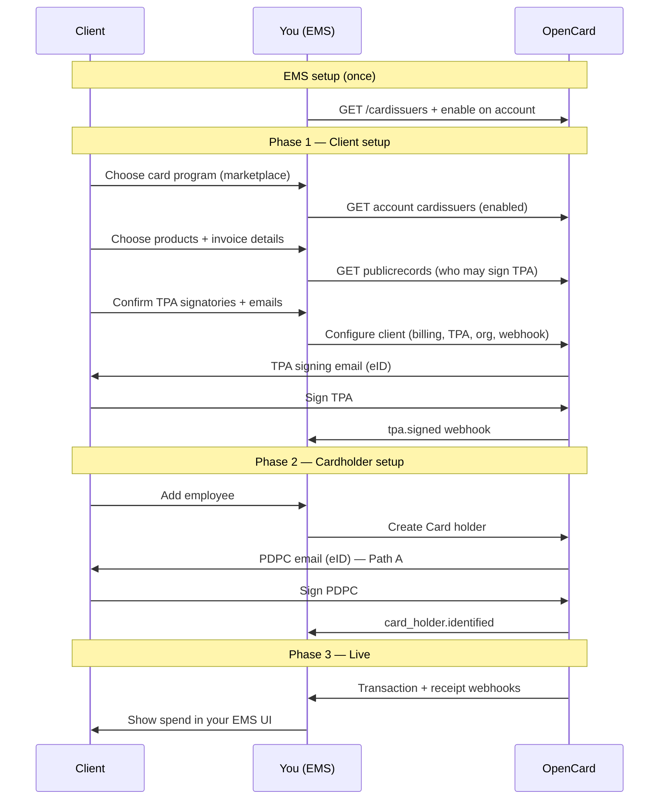
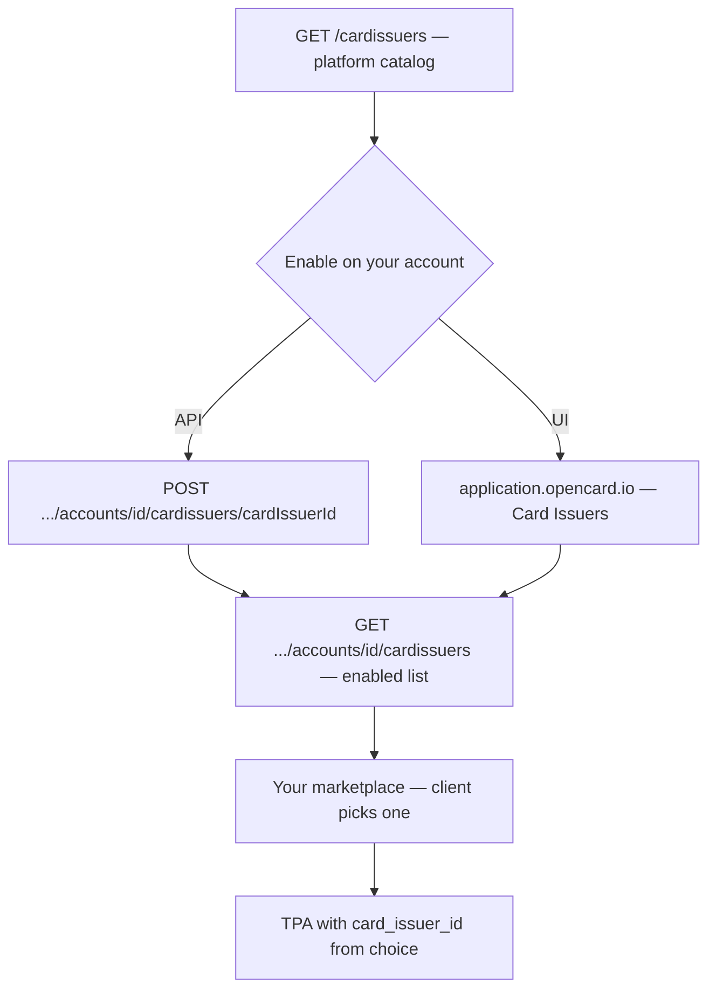
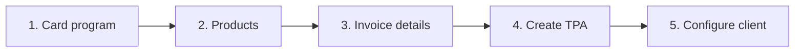

This is the **end-to-end path** for connecting one of your clients to OpenCard. Everything you need lives in the Application API — no embed plugin required. The guides below this page go deeper on TPA signing, eID, and card holders.

---

## Who does what

| Actor | Role |
|-------|------|
| **Client** | Your end-customer company — signs the TPA; their employees sign PDPC |
| **You (EMS)** | Orchestrate setup in your product — call OpenCard APIs, store `reference_id`s, show status in your UI |
| **OpenCard** | Legal signing (eID), card issuer communication, webhooks with transactions and enrichment |

You own the UX. OpenCard owns signing pages, identity verification, and data delivery.

---

## Big picture



---

## Before Phase 1 — Card issuers (EMS setup)

Client onboarding starts with **choosing a card program**. That only works if you have already decided **which issuers your EMS offers**. This is a **one-time account setup** — not part of the per-client wizard.



### 1. Discover available programs

```
GET /cardissuers
Scope: card-issuers-read
```

Returns every card program on the OpenCard platform. Your EMS account does **not** have them yet — this is the full catalog.

→ [List available issuers](/api-reference/ems/card-issuers/list-available-issuers)

### 2. Enable the ones you sell

Pick the programs you want in your product, then attach them to **your account**:

```
POST /accounts/{accountId}/cardissuers/{cardIssuerId}
Scope: account-card-issuers-write
```

You can do this via the API or in **[application.opencard.io](https://application.opencard.io)** under **Card Issuers** (enable / disable per program). Same result either way.

→ [Enable issuer](/api-reference/ems/card-issuers/enable-issuer) · [Quickstart](/getting-started/quickstart#step-2-enable-a-card-issuer)

### 3. Show enabled programs in your marketplace

When a **client** onboards, list only what you enabled:

```
GET /accounts/{accountId}/cardissuers
Scope: account-card-issuers-read
```

Build a marketplace (or wizard step) where the client picks one program. Store the chosen **`id`** — that becomes `card_issuer_id` when you create the TPA.

The optional [ocTPA plugin](/ems/plugins) renders the same step as product cards. Fields it uses from each enabled issuer:

| API field | Use in UI |
|-----------|-----------|
| `name_product` | Card title |
| `type_product` | Subtitle (e.g. Corporate Card, Credit Card) |
| `logo_url` | Issuer logo |
| `product_description_short` | Short description on the card |
| `card_scheme_logo_url` | Visa / Mastercard badge |
| `name_display` | Confirmation screen after selection |
| `product_description_long` | Longer copy on confirmation |
| `id` | **`card_issuer_id`** on `POST .../tpas` |

Filter by `name_system` if you only expose a subset (`allowedCardIssuerIds` in the plugin).

---

## Phase 1 — Client setup

This is what the **client** walks through in your product (same order as the optional [ocTPA plugin](/ems/plugins)). You collect choices in the UI, then create the OpenCard resources.



### 1. Choose card program

The client picks from **your enabled list** (see above). You already called:

```
GET /accounts/{accountId}/cardissuers
```

Pass the chosen issuer's `id` as `card_issuer_id` when you create the TPA in step 4.

Enabling new issuers on the account is EMS setup — not something the end-client does. → [Before Phase 1 — Card issuers](#before-phase-1--card-issuers-ems-setup)

### 2. Choose products

What OpenCard should deliver for this client. Stored as flags on the **billing** profile when you create it:

<table>
  <thead>
    <tr>
      <th width="42%">Field</th>
      <th>Meaning</th>
      <th width="22%">Typical UX</th>
    </tr>
  </thead>
  <tbody>
    <tr>
      <td><code>product_transaction</code></td>
      <td>Real-time transaction states to your webhooks</td>
      <td>Usually always on</td>
    </tr>
    <tr>
      <td><code>product_digital_receipt</code></td>
      <td>Digital receipts from the merchant network</td>
      <td>Optional toggle</td>
    </tr>
    <tr>
      <td><code>product_aland_index</code></td>
      <td>Environmental impact estimates</td>
      <td>Optional toggle</td>
    </tr>
  </tbody>
</table>

Transactions are the core product. Receipts and environmental impact are enriched add-ons — same split the plugin uses (“Transaction information” vs “Enriched information”).

→ [Billing](/ems/model/billing) · [Receipts](/ems/receipts) · [Environmental impact](/ems/environmental-impact)

### 3. Invoice details (for your OpenCard bill)

Collect how **you** (the EMS) want this client represented on the invoice OpenCard sends **you**:

- Invoice email (`email_invoice`)
- Your reference (`your_reference_invoice`)
- Legal name / org number / address (often from public records)

Organizations that share the same billing profile appear as **one line** on that invoice — not as separate invoices per organization. This is not the bank’s card invoice to the client.

→ [Billing](/ems/model/billing)

### 4. Create the TPA (company authorisation)

A **TPA** (Transaction Processing Authorisation) is the legal agreement that this company allows card transaction data from the chosen card program to flow through OpenCard to **your EMS**.

Look up who is allowed to sign:

```
GET /accounts/{accountId}/publicrecords?country=SE&organization_number=...
```

Use `signature_combinations` when present so the client picks a valid signing group. Collect **name + email** for each person who will sign (or allow manual entry when the registry has no combinations).

You create the TPA and signatories in the next step. Full walkthrough → [TPA flow](/ems/tpa-flow) · [eID signing](/ems/eid-signing)

### 5. Configure the client

When the client confirms steps 1–4, create the OpenCard resources (same payload shape the [ocTPA plugin](/ems/plugins) returns in `onDataSend`):

```
POST /accounts/{accountId}/billings                         ← invoice line + product flags
POST /accounts/{accountId}/tpas                            ← company + card_issuer_id
POST /accounts/{accountId}/tpas/{tpaId}/signatories        ← emails → eID signing links
POST /accounts/{accountId}/organizations                   ← runtime container
POST /accounts/{accountId}/organizations/{id}/webhooks     ← event delivery
```

OpenCard emails each TPA signatory. They sign with national **eID**. You wait for status — do not build your own signing UI.

| Event / signal | Meaning |
|----------------|---------|
| Signatory signs | Progress toward fully signed |
| `tpa.signed` webhook | All required signatures done — PDF ready |
| Status → `activated` | TPA confirmed — transactions can flow |

**Organization body** — link the TPA and billing you created. `reference_id` is **your** internal client ID (returned on every webhook):

```json
{
  "reference_id": "client_acme_001",
  "tpa_id": 42,
  "billing_id": 1,
  "name": "Acme AB"
}
```

Complete the [webhook challenge handshake](/ems/webhooks/setup#challenge-handshake) so `active=true` and events can be delivered.

→ [Billing](/ems/model/billing) · [Organization](/ems/model/organization) · [Webhook setup](/ems/webhooks/setup) · [TPA flow](/ems/tpa-flow)

Client setup is complete when the TPA is signed (ideally activated), the organization exists with `billing_id` + `tpa_id`, and the webhook is active.

---

## Phase 2 — Cardholder setup

Goal: each person whose card spend you want is identified in OpenCard.

```
POST /accounts/{accountId}/organizations/{organizationId}/cardholders
```

| Path | You send | User action | Transactions start |
|------|----------|-------------|--------------------|
| 🅰️ Email | `email` | Signs PDPC with eID | After `card_holder.identified` |
| 🅱️ Instant | `identity_id` | None | Immediately |

OpenCard handles PDPC email + eID. You handle status in your UI (`card_holder.identified`, `card_holder.signed.pdpc`).

→ [Card holder onboarding](/ems/card-holders) · [Model: Card holder](/ems/model/card-holder) · [eID signing](/ems/eid-signing)

Cardholder is onboarded when you receive `card_holder.identified` — then expect transactions (including a retroactive batch).

---

## Phase 3 — Live

Once card holders are identified and the TPA is activated:

1. Card issuer pushes transaction states to OpenCard
2. OpenCard POSTs to your organization webhook (`card.transaction.*`)
3. Enrichment may follow: `receipt.fetched`, true VAT, line items, environmental impact

→ [Transaction states](/ems/webhooks/transactions) · [Events](/ems/webhooks/events) · [Receipts](/ems/receipts)

---

## Ordered checklist

Do this **per client** (after your account + OAuth client exist):

| # | Step | API / action | Detail guide |
|---|------|--------------|--------------|
| 0 | Enable card issuer(s) on account (once) | `GET /cardissuers` → `POST .../accounts/{id}/cardissuers/{id}` (or [application.opencard.io](https://application.opencard.io)) | [Before Phase 1](#before-phase-1--card-issuers-ems-setup) |
| 1 | Client picks card program in your marketplace | `GET .../accounts/{id}/cardissuers` → `card_issuer_id` on TPA | below |
| 2 | Client picks products | Flags on billing create | [Billing](/ems/model/billing) |
| 3 | Invoice email / reference | Part of billing create | [Billing](/ems/model/billing) |
| 4 | Create TPA (who signs) | `GET` publicrecords — collect signatories | [TPA flow](/ems/tpa-flow) |
| 5 | Configure client | `POST` billings, tpas, signatories, orgs, webhooks | [Billing](/ems/model/billing) · [Webhooks](/ems/webhooks/setup) |
| 6 | Wait for eID + `tpa.signed` | Webhook / status | [eID signing](/ems/eid-signing) |
| 7 | Create card holders | `POST` cardholders | [Card holders](/ems/card-holders) |
| 8 | Wait for `card_holder.identified` | Webhook | [Card holders](/ems/card-holders) |
| 9 | Handle transactions + enrichment | Webhooks | [Transactions](/ems/webhooks/transactions) |

---

## Build it yourself vs embed plugin

| Approach | When |
|----------|------|
| **API only (this guide)** | Rebuild the same steps in your own UI — recommended for production |
| **[ocTPA plugin](/ems/plugins)** | Ready-made wizard: issuer → products → invoice → signatories; **you still POST** billing / TPA / signatories from `onDataSend` |

The plugin mirrors steps 1–4 in the UI and gives you billing / TPA / signatory data in `onDataSend`. Step 5 (organization + webhook) and card holders stay in your integration.

---

## Deep dives in this section

| Page | What it covers |
|------|----------------|
| [TPA flow](/ems/tpa-flow) | Create TPA, signatories, activation, signed PDF |
| [eID signing](/ems/eid-signing) | Sign vs auth modes across Nordic countries |
| [Card holder onboarding](/ems/card-holders) | Email vs `identity_id`, webhooks, updates |

**Models** (what each entity is): [Billing](/ems/model/billing) · [Organization](/ems/model/organization) · [TPA](/ems/model/tpa) · [Card holder](/ems/model/card-holder)
