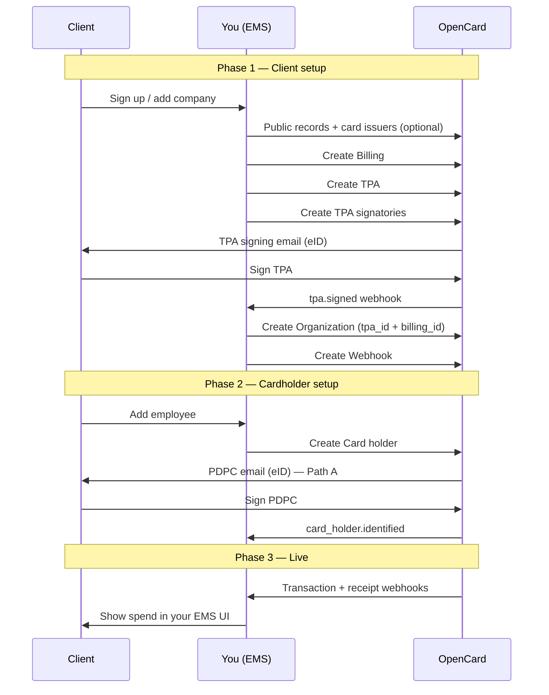

This is the **end-to-end path** for connecting one of your clients to OpenCard. Everything you need lives in the Application API — no embed plugin required. The guides below this page go deeper on TPA signing, eID, and card holders.

---

## Who does what

| Actor | Role |
|-------|------|
| **Client** | Your end-customer company — signs the TPA; their employees sign PDPC |
| **You (EMS)** | Orchestrate setup in your product — call OpenCard APIs, store `reference_id`s, show status in your UI |
| **OpenCard** | Legal signing (eID), card issuer communication, webhooks with transactions and enrichment |

You own the UX. OpenCard owns signing pages, identity verification, and data delivery.

---

## Big picture



---

## Phase 1 — Client setup

Goal: legal permission + a runtime container (organization + webhook) so data has somewhere to go.

### 1. Look up the company (recommended)

```
GET /accounts/{accountId}/publicrecords?country=SE&organization_number=...
GET /cardissuers
GET /accounts/{accountId}/cardissuers
```

Use public records to suggest authorized signatories. Use card issuers to pick which card program this client uses.

→ [TPA flow — who can sign](/ems/tpa-flow) · [Model: TPA](/ems/model/tpa)

### 2. Create billing

```
POST /accounts/{accountId}/billings
```

Billing is **how OpenCard invoices you** (the EMS), not how the client's bank invoices them. Link one or many organizations to the same `billing_id` if you want them on one OpenCard invoice.

→ [Billing](/ems/model/billing)

### 3. Create TPA + signatories

```
POST /accounts/{accountId}/tpas
POST /accounts/{accountId}/tpas/{tpaId}/signatories
```

OpenCard emails each signatory a link. They sign with national **eID**. You wait for status — do not invent your own signing UI.

| Event / signal | Meaning |
|----------------|---------|
| Signatory signs | Progress toward fully signed |
| `tpa.signed` webhook | All required signatures done — PDF ready |
| Status → `activated` | Issuer confirmed — transactions can flow |

→ [TPA flow](/ems/tpa-flow) · [eID signing](/ems/eid-signing)

### 4. Create organization

```
POST /accounts/{accountId}/organizations
```

```json
{
  "reference_id": "client_acme_001",
  "tpa_id": 42,
  "billing_id": 1,
  "name": "Acme AB"
}
```

`reference_id` = **your** client ID — it comes back on every webhook.

→ [Organization](/ems/model/organization)

### 5. Create webhook

```
POST /accounts/{accountId}/organizations/{organizationId}/webhooks
```

Pass the challenge handshake before `active=true`. Subscribe at least to transaction + card-holder events.

→ [Webhook setup](/ems/webhooks/setup)

**Client setup is complete** when: TPA is signed (ideally activated), organization exists with `billing_id` + `tpa_id`, and webhook is active.

---

## Phase 2 — Cardholder setup

Goal: each person whose card spend you want is identified in OpenCard.

```
POST /accounts/{accountId}/organizations/{organizationId}/cardholders
```

| Path | You send | User action | Transactions start |
|------|----------|-------------|--------------------|
| 🅰️ Email | `email` | Signs PDPC with eID | After `card_holder.identified` |
| 🅱️ Instant | `identity_id` | None | Immediately |

OpenCard handles PDPC email + eID. You handle status in your UI (`card_holder.identified`, `card_holder.signed.pdpc`).

→ [Card holder onboarding](/ems/card-holders) · [Model: Card holder](/ems/model/card-holder) · [eID signing](/ems/eid-signing)

**Cardholder is onboarded** when you receive `card_holder.identified` — then expect transactions (including a retroactive batch).

---

## Phase 3 — Live

Once card holders are identified and the TPA is activated:

1. Card issuer pushes transaction states to OpenCard
2. OpenCard POSTs to your organization webhook (`card.transaction.*`)
3. Enrichment may follow: `receipt.fetched`, true VAT, line items, environmental impact

→ [Transaction states](/ems/webhooks/transactions) · [Events](/ems/webhooks/events) · [Receipts](/ems/receipts)

---

## Ordered checklist

Do this **per client** (after your account + OAuth client exist):

| # | API | Detail guide |
|---|-----|--------------|
| 1 | Enable card issuer on account (once per program) | [Quickstart](/getting-started/quickstart) |
| 2 | `POST .../billings` | [Billing](/ems/model/billing) |
| 3 | `POST .../tpas` | [TPA flow](/ems/tpa-flow) |
| 4 | `POST .../tpas/{id}/signatories` | [TPA flow](/ems/tpa-flow) |
| 5 | Wait for eID + `tpa.signed` | [eID signing](/ems/eid-signing) |
| 6 | `POST .../organizations` (`tpa_id`, `billing_id`, `reference_id`) | [Organization](/ems/model/organization) |
| 7 | `POST .../webhooks` + pass challenge | [Webhook setup](/ems/webhooks/setup) |
| 8 | `POST .../cardholders` (email or `identity_id`) | [Card holders](/ems/card-holders) |
| 9 | Wait for `card_holder.identified` | [Card holders](/ems/card-holders) |
| 10 | Handle `card.transaction.*` (+ enrichment) | [Transactions](/ems/webhooks/transactions) |

---

## Build it yourself vs embed plugin

| Approach | When |
|----------|------|
| **API only (this guide)** | You want full control in your product — recommended for a production integration |
| **[ocTPA / ocPDPC plugins](/ems/plugins)** | Optional UI helpers that collect form data; **you still call the same APIs** |

The plugin does not replace this flow — it only helps collect billing / TPA / signatory fields before you POST them.

---

## Deep dives in this section

| Page | What it covers |
|------|----------------|
| [TPA flow](/ems/tpa-flow) | Create TPA, signatories, activation, signed PDF |
| [eID signing](/ems/eid-signing) | Sign vs auth modes across Nordic countries |
| [Card holder onboarding](/ems/card-holders) | Email vs `identity_id`, webhooks, updates |

**Models** (what each entity is): [Billing](/ems/model/billing) · [Organization](/ems/model/organization) · [TPA](/ems/model/tpa) · [Card holder](/ems/model/card-holder)
