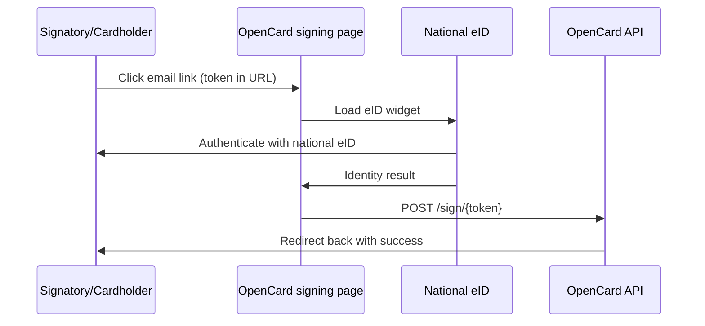

OpenCard uses **national eID** for electronic identity and signing across all four Nordic countries.

Used in customer onboarding for **TPA** (company signatories) and **PDPC** (card holders). → [Full onboarding flow](/ems/customer-onboarding)

Two modes:

| Mode | Used for | What happens |
|------|----------|--------------|
| **`sign`** | TPA signing | User signs a specific legal document (hash-bound) |
| **`auth`** | PDPC consent | User identifies themselves + checks consent box |

---

## Countries

| Country | Supported |
|---------|-----------|
| 🇸🇪 Sweden | ✅ |
| 🇳🇴 Norway | ✅ |
| 🇩🇰 Denmark | ✅ |
| 🇫🇮 Finland | ✅ |

Legal text and the signing UI follow the country on the TPA or PDPC. In Finland the user may choose between available national eID options.

---

## How the token flow works



The signatory or card holder never needs an OpenCard account. The token in the email link is their authentication.

---

## TPA signing page

**URL:** `GET /accounts/{accountId}/tpas/{tpaId}/sign/{token}`

**What the user sees:**

1. TPA legal text (rendered markdown)
2. "Sign" button → eID widget
3. National eID provider for the company's country
4. Document signing (legal text is bound to the signature)

On success the signatory is marked signed and OpenCard checks whether the TPA is fully signed.

Full TPA flow → [TPA Flow](/ems/tpa-flow)

---

## PDPC signing page

**URL:** `GET /accounts/{accountId}/pdpcs/{pdpcId}/sign/{token}`

**What the user sees:**

1. PDPC legal text
2. Checkbox: "I have read the text above"
3. "Approve & Identify" button
4. eID widget in **`auth`** mode (identity only, no document hash)

On success:

- Identity created or matched
- Card holder linked
- PDPC marked signed
- Signed PDF generated and emailed to the cardholder
- `card_holder.signed.pdpc` webhook fires

Full card holder flow → [Card Holder Onboarding](/ems/card-holders)

---

## Supported languages for legal text

Templates available in: `sv`, `no`, `da`, `en`, `fi`

Query available languages:

```
GET /api/v1/application/open/legaltexts?type=tpa
GET /api/v1/application/open/legaltexts?type=pdpc
```

No auth required for this endpoint.
