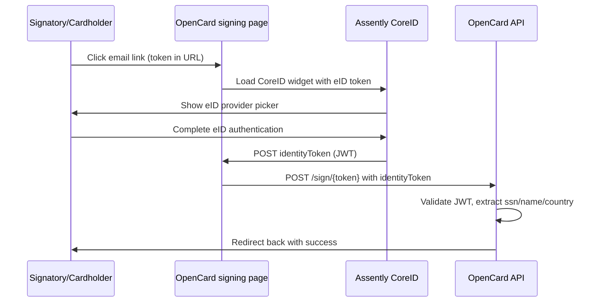

OpenCard uses **[Assently CoreID](https://coreid.assently.com)** for electronic identity across all four Nordic countries.

Two modes:

| Mode | Used for | What happens |
|------|----------|--------------|
| **`sign`** | TPA signing | User signs a specific legal document (hash-bound) |
| **`auth`** | PDPC consent | User identifies themselves + checks consent box |

---

## Countries

| Country | Location | Default provider | UI language |
|---------|----------|------------------|-------------|
| 🇸🇪 Sweden | `se` | `se-bankid` | `sv` |
| 🇳🇴 Norway | `no` | `no-bankid-oidc` | `no` |
| 🇩🇰 Denmark | `dk` | `dk-mitid` | `da` |
| 🇫🇮 Finland | `fi` | user picks | `fi` |

Finland: user selects from `fi-mv-telia`, `fi-tupas`, or `fi-vrk`. Denmark also supports legacy `dk-nemid`.

---

## How the token flow works



### Server-side token generation

OpenCard generates an outbound JWT for Assently with claims:
- `iss`, `aud`, `jti`, `iat`, `exp`
- `hst`, `dnm` (host/domain binding)
- `response_mode: form_post`
- `redirect_uri` → the POST sign endpoint

### Inbound validation

When Assently returns `identityToken`:
- Validated against `ASSENTLY_IDENTITY` public key
- Claims extracted:

| JWT claim | Stored as |
|-----------|-----------|
| `sub.national_id` | `ssn` (encrypted) |
| `provider` (first 2 chars) | country |
| `sub.full_name` or name parts | `name` |
| Full claims JSON | `signature` (encrypted) |

---

## TPA signing page

**URL:** `GET /accounts/{accountId}/tpas/{tpaId}/sign/{token}`

No login required. The 40-char token in the URL **is** the authentication.

**What the user sees:**
1. TPA legal text (rendered markdown)
2. "Sign" button → Assently widget
3. eID provider selection (country-specific)
4. Document signing with legal text hash:

```javascript
// TPA sign config sent to Assently
{
  mode: 'sign',
  sign: {
    title: 'Sign Transaction Processing Authorisation',
    data: legalTextHash,  // SHA-256 of legal text content
    type: 'text'
  }
}
```

**POST:** `POST /accounts/{accountId}/tpas/{tpaId}/sign/{token}`
Body: `identityToken={assently_jwt}`

CSRF exempt on POST (external redirect from Assently).

---

## PDPC signing page

**URL:** `GET /accounts/{accountId}/pdpcs/{pdpcId}/sign/{token}`

**What the user sees:**
1. PDPC legal text
2. Checkbox: "I have read the text above"
3. "Approve & Identify" button
4. Assently widget in **`auth`** mode (identity only, no document hash)

**POST:** same pattern with `identityToken`

On success:
- Identity created/found by SSN
- Card holder linked
- PDPC marked signed
- Signed PDF generated + emailed to cardholder
- `card_holder.signed.pdpc` webhook fires

---

## Supported languages for legal text

Templates available in: `sv`, `no`, `da`, `en`, `fi`

Query available languages:
```
GET /api/v1/application/open/legaltexts?type=tpa
GET /api/v1/application/open/legaltexts?type=pdpc
```

No auth required for this endpoint.
