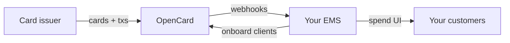

This section is for **Expense Management Systems (EMS)** — the apps that show employees and finance teams their card spend.

OpenCard sits between **card issuers** and **you**. Issuers send card and transaction data to OpenCard. You receive it as webhooks, enriched with digital receipts, VAT, line items, and more when available.

Your job has two halves. Both matter — and both should live **in your product**, not only in OpenCard's UI.

---

## What you integrate

| Half | You build | OpenCard does |
|------|-----------|---------------|
| **Receive data** | HTTPS endpoint + auth + challenge | POSTs transactions, TPA events, card-holder events, enrichment |
| **Onboard customers** | Marketplace, TPA flow, card-holder maintenance in your UX | eID signing, issuer handoff, matching, webhook delivery |

We recommend you **build the integration** end to end. OpenCard's application and optional [plugins](/ems/plugins) exist as shortcuts — the durable path is your own API integration.

---

## 1. Receive data — webhooks first

Before a single client is live, decide **where** OpenCard should send events and **which** events you want.

1. Stand up an HTTPS endpoint that accepts POSTs from OpenCard
2. Choose a **security scheme** (`basic`, `oauth`, `custom`, or `none`) so only OpenCard can call you
3. Complete the **webhook challenge** (HMAC handshake) so OpenCard knows you own the URL
4. Subscribe to the events you need — transactions, TPA signed, card holder identified, receipts, TrueVAT, line items, …

Every organization has its own webhook config. Transaction data arrives here — there is no “list all transactions” pull API for day-to-day spend.

| Guide | What it covers |
|-------|----------------|
| [Webhook setup](/ems/webhooks/setup) | Create webhook, auth, **challenge**, event flags |
| [Webhook events](/ems/webhooks/events) | Full catalog + payload samples |
| [Transactions](/ems/webhooks/transactions) | States, `receiptable`, how to apply updates |
| [Authentication](/getting-started/authentication) | OAuth client credentials for your outbound API calls |

---

## 2. Onboard customers — in your product

Once webhooks work, wire **client onboarding** into your EMS. That is the path we want partners on.

### Marketplace — payment products

Show the cards you sell. Clients pick a **payment product** before legal setup.

→ [Payment product setup](/ems/payment-products-setup)

### TPA — company authorization

Create the **Transaction Processing Authorization**, look up who may sign via **public records**, collect signatory emails, and let OpenCard run eID signing. You get `tpa.signed` when it is done.

→ [Customer onboarding](/ems/customer-onboarding) · [TPA flow](/ems/tpa-flow) · [eID signing](/ems/eid-signing)

### Card holders — keep people in sync

Create and maintain **card holders** for each employee whose spend should appear. Email + PDPC, or instant match with `identity_id` when the person is already known to OpenCard.

→ [Card holders](/ems/card-holders)

---

## Recommended order

| Step | Goal | Start here |
|------|------|------------|
| **A** | Sandbox account + OAuth client | [Register](/getting-started/register) · [Quickstart](/getting-started/quickstart) |
| **B** | Webhook URL, auth, challenge, event flags | [Webhook setup](/ems/webhooks/setup) |
| **C** | Enable payment products on your account | [Payment product setup](/ems/payment-products-setup) |
| **D** | One test client: billing → TPA → org → webhook | [Customer onboarding](/ems/customer-onboarding) |
| **E** | Card holders → first live / sandbox transactions | [Card holders](/ems/card-holders) |
| **F** | Enrichment (receipts, environment) as needed | [Digital receipts](/ems/receipts) · [Environmental impact](/ems/environmental-impact) |

---

## The model (why the entities exist)

You will create **billing**, **organization**, **TPA**, and **card holder** records while onboarding. They are not abstract — each maps to invoice roll-up, a client company, legal permission, or an employee.

| Concept | Role |
|---------|------|
| [Billing](/ems/model/billing) | Who OpenCard invoices **you** for; orgs with the same `billing_id` roll up as one line |
| [Organization](/ems/model/organization) | One end-client (your customer company) |
| [TPA](/ems/model/tpa) | Company-level permission for card data to flow to your EMS |
| [Card holder](/ems/model/card-holder) | One person whose transactions you receive |

Deep hierarchy context → [How OpenCard works](/introduction/how-it-works)

---

## Map of this section

<CardGroup cols={2}>
  <Card title="Customer onboarding" icon="user-plus" href="/ems/customer-onboarding">
    End-to-end client setup — marketplace, TPA, public records, card holders, then live webhooks.
  </Card>
  <Card title="Webhooks" icon="webhook" href="/ems/webhooks/setup">
    Endpoint, security scheme, challenge, and every event you can subscribe to.
  </Card>
  <Card title="Model" icon="sitemap" href="/ems/model/billing">
    Billing, organization, TPA, and card holder — the objects your API calls create.
  </Card>
  <Card title="EMS API" icon="code" href="/api-reference/ems/overview">
    Application API reference — payment products, public records, TPAs, orgs, webhooks.
  </Card>
</CardGroup>

Also useful: [Current card issuer integration](/ems/current-card-issuer-integration) if the client already has an issuer feed, [Error handling](/ems/error-handling), and [Plugins](/ems/plugins) if you temporarily use OpenCard-hosted UI widgets.
