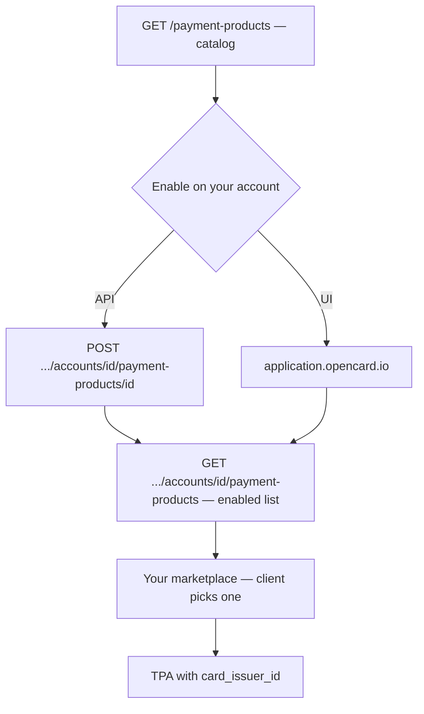

Client onboarding starts with **choosing a payment product**. That only works if you have already decided **which products your EMS offers**. This is a **one-time account setup** — not part of the per-client wizard.

<Tip>
  Part of the full path → [Customer onboarding overview](/ems/customer-onboarding)
</Tip>

A payment product is the card a client activates — for example a debit or credit card under a program, issued by a bank.



---

## 1. Browse the catalog

```
GET /payment-products
Scope: payment-products-read
```

Returns every payment product on the OpenCard platform. Your EMS account does **not** have them yet — this is the full catalog.

Optional query params:

| Param | What it does |
|-------|----------------|
| `q` | Space-separated search across product name, subtitle, and program name |
| `funding` | `debit` or `credit` |
| `per_page` | Page size (default 15) |

→ [List available payment products](/api-reference/ems/payment-products/list-available-payment-products)

---

## 2. Enable the ones you sell

Pick the products you want in your marketplace, then attach them to **your account**:

```
POST /accounts/{accountId}/payment-products/{id}
Scope: account-payment-products-write
```

Empty body. `201` on success; `400` if that product is already enabled.

You can do this via the API or in **[application.opencard.io](https://application.opencard.io)**. Same result either way.

→ [Enable payment product](/api-reference/ems/payment-products/enable-payment-product) · [Quickstart](/getting-started/quickstart#step-2-enable-a-payment-product)

---

## 3. Show enabled products in your marketplace

When a **client** onboards, list only what you enabled:

```
GET /accounts/{accountId}/payment-products
Scope: account-payment-products-read
```

Same optional query params as the catalog:

| Param | What it does |
|-------|----------------|
| `q` | Space-separated search across product name, subtitle, and program name |
| `funding` | `debit` or `credit` |
| `per_page` | Page size (default 15) |

Build a marketplace (or wizard step) where the client picks one product. Store **`card_issuer_id`** — you pass that when you create the TPA.

The optional [ocTPA plugin](/ems/plugins) renders the same step as product cards:

<div className="oc-tpa-preview">
  <div className="oc-tpa-card">
    <div className="oc-tpa-card-header">
      <div>
        <div className="oc-tpa-card-title">Nordea Business Card</div>
        <div className="oc-tpa-card-subtitle">Corporate Card</div>
      </div>
      <div className="oc-tpa-card-logo-wrap">
        
      </div>
    </div>
    <p className="oc-tpa-card-desc">
      Corporate card with real-time transaction data, digital receipts, and expense enrichment via OpenCard.
    </p>
    <div className="oc-tpa-card-footer">
      <div className="oc-tpa-card-scheme-wrap">
        
      </div>
      <div className="oc-tpa-card-actions">
        <span className="oc-tpa-btn-outline">Info &amp; Pricing</span>
        <span className="oc-tpa-btn-primary">Activate</span>
      </div>
    </div>
  </div>
</div>

Fields from each enabled product:

| API field | Use in UI |
|-----------|-----------|
| `name` | Card title |
| `subtitle` | Subtitle (e.g. Corporate Card) |
| `description_short` | Short description on the card |
| `description_long` | Longer copy on confirmation |
| `payment_program.name` | Program name on confirmation |
| `payment_program.logo_url` | Program logo |
| `scheme.name` | Card scheme (`mastercard`, `visa`) |
| `scheme.logo_url` | Visa / Mastercard badge |
| `card_issuer_id` | Pass this as `card_issuer_id` on `POST .../tpas` |

---

## Next step

Once products are enabled, each client picks one in Phase 1 and you create the TPA with that `card_issuer_id`.

→ [TPA flow](/ems/tpa-flow) · [Customer onboarding — Phase 1](/ems/customer-onboarding#phase-1--client-setup)
