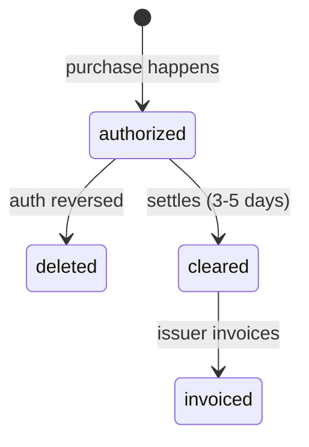

Getting transaction states wrong = angry accountants. Here's the exact logic.

---

## The 4 states



| State | Timing | Amounts reliable? | Use for accounting? |
|-------|--------|-------------------|---------------------|
| `authorized` | Seconds after purchase | ❌ May change | Preview only |
| `deleted` | Before clearing | N/A | Delete from your system |
| `cleared` | 3-5 days after purchase | ✅ Final | **YES** |
| `invoiced` | When issuer invoices | ✅ Final + invoice # | YES |

---

## Recommended implementation

```javascript
async function handleTransaction(event, payload) {
  const txId = payload.id;
  const state = payload.state; // from X-Event suffix or payload.state

  switch (event) {
    case 'card.transaction.authorized':
      // Create if not exists (upsert by id)
      await db.transactions.upsert(txId, { ...payload, status: 'pending' });
      break;

    case 'card.transaction.cleared':
    case 'card.transaction.invoiced':
      // Update existing OR create if you skipped authorized
      await db.transactions.upsert(txId, { ...payload, status: 'confirmed' });
      break;

    case 'card.transaction.deleted':
      // Only relevant if you stored authorized
      await db.transactions.delete(txId);
      break;
  }
}
```

### The golden rules

1. **Always handle `cleared`** — non-negotiable for accounting
2. **`authorized` + `deleted` + `cleared`** = best UX (users see purchases instantly, deletions handled)
3. **`authorized` alone** = you'll miss transactions that clear without prior auth (rare but possible)
4. **Use `id` as primary key** — same `id` across all states for one transaction
5. **`card_issuer_reference` differs per state** — don't use it as your primary key; when merging with another feed, compare cleared-to-cleared only → [Current card issuer integration](/ems/current-card-issuer-integration)

---

## Current card issuer integration

If your client already receives transactions from the same card program through another integration, you can run both feeds at once. OpenCard is often added while the old feed is still active — you do not need to wait for it to be switched off.

- Start the OpenCard feed per card holder on **`card_holder.identified`** (includes a retroactive batch).
- **Upsert on transaction `id`** for OpenCard events.
- On **`card.transaction.cleared`**, deduplicate against your other store with **`card_issuer_reference`** — cleared matches cleared only; auth and cleared references may differ per issuer.

Full guidance → [Current card issuer integration](/ems/current-card-issuer-integration)

## Upsert logic detail

| Event | Transaction exists? | Action |
|-------|-------------------|--------|
| `authorized` | No | Create |
| `authorized` | Yes | Update (amounts may change before clearing) |
| `cleared` | No | Create (you missed authorized — still ok) |
| `cleared` | Yes | Update with final amounts |
| `invoiced` | No | Create |
| `invoiced` | Yes | Update, set `invoice_number` |
| `deleted` | Yes | Delete |
| `deleted` | No | Ignore (nothing to delete) |

---

## `receiptable` flag

```json
{ "receiptable": true }
```

If `true`, a digital receipt may arrive later via `receipt.fetched`. If `false`, don't wait for one.

Subscribe to `receipt_fetched`, `transaction_true_vat`, and `transaction_line_items` separately — they come as independent events after the transaction.

---

## Card types

| `card_type` | Meaning |
|-------------|---------|
| `corporate` | Company card, company pays |
| `private` | Personal card |
| `corporate_with_private_invoice` | Company card, employee reimbursed privately |

## Card funding

| `card_funding` | Meaning |
|----------------|---------|
| `credit` | Credit card |
| `debit` | Debit card |

Present on **all** `card.transaction.*` states — same value for a given card across authorized / cleared / deleted / invoiced.

Verify with your client which card types to include. Common setup: corporate only.

---

## VAT caveat

`vat_rate` and `vat_amount` on the transaction payload come from the **card network** — often wrong for restaurants, hotels, etc.

For correct VAT, subscribe to `transaction.true.vat` — that comes from the actual merchant receipt.
