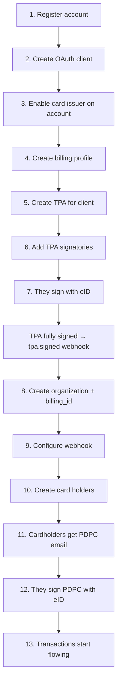

## The hierarchy (memorize this)

```
Account          ← you (the EMS partner)
├── Billing      ← how OpenCard invoices YOU (group orgs on one invoice)
└── Organization ← your end-client company
    ├── billing_id → links to a Billing profile
    ├── Webhook    ← where events get POSTed
    ├── CardHolder ← employee whose card data you want
    │   └── Card ← actual credit card (managed by issuer)
    │       └── Transaction
    │           └── TransactionState (authorized → cleared → invoiced)
    └── TPA        ← legal agreement (signed by client's authorized signatories)
```

**Account** = your OpenCard partner account. One per EMS.

**Billing** = invoice grouping for **your** OpenCard bill. One billing profile can cover one or many organizations. Example: three orgs share `billing_id: 1` → one combined invoice from OpenCard to your finance team. → [Billing](/ems/model/billing)

**Organization** = one of your customers. You set `reference_id` to your internal client ID. Most EMSs map 1:1 (one org per client), but you can split one client into multiple orgs if you need different webhook configs or card type filters. → [Organization](/ems/model/organization)

**Card Holder** = a person. You set `reference_id` to your internal user ID. Two ways to onboard: **email** (user signs with eID) or **`identity_id`** (instant, person already in OpenCard). → [Card holder](/ems/model/card-holder) · [Onboarding](/ems/card-holders)

**TPA** (Transaction Processing Authorization) = legal doc the client's signatories sign saying "yes, our card data can flow to this EMS via OpenCard." → [TPA](/ems/model/tpa)

**PDPC** (Personal Data Processing Consent) = GDPR consent the individual cardholder signs saying "yes, my transactions can be shared."

## Two legal docs, two audiences

| Doc | Who signs | How | Purpose |
|-----|-----------|-----|---------|
| **TPA** | Company's authorized signatories (CEO, board, etc.) | eID **sign** mode — they sign the actual legal document | Company-level permission |
| **PDPC** | Individual cardholder (employee) | eID **auth** mode — identity verification + consent checkbox | Person-level GDPR consent |

OpenCard handles all of this. For new users you provide an email — we send the link, they sign with eID. For users already in OpenCard you pass `identity_id` and skip the wait entirely.

## The full onboarding sequence



Step-by-step for EMS integrators (APIs, phases, checklist) → [Customer onboarding](/ems/customer-onboarding)

## Runtime: what happens on a purchase

1. **Cardholder buys coffee** ☕
2. **Issuer** sends `authorized` transaction state to OpenCard
3. OpenCard normalizes the data, checks org/webhook config
4. **Your webhook** gets `card.transaction.authorized` within seconds
5. If merchant is receipt-enabled → OpenCard requests receipt match
6. 3–5 days later issuer sends `cleared` state
7. Your webhook gets `card.transaction.cleared` — **this is the accounting truth**
8. Maybe `receipt.fetched`, `transaction.true.vat`, `transaction.line_items` follow

## What you build vs what OpenCard builds

| You build | OpenCard builds |
|-----------|-----------------|
| Webhook endpoint + event handlers | Legal signing flows (TPA + PDPC) |
| Org/cardholder CRUD in your UI | eID signing flows |
| Map `reference_id` to your DB | Issuer communication |
| Transaction UI in your expense app | Receipt matching orchestration |
| | Webhook delivery + retry + logs |

## Reference IDs — your best friend

Every organization and card holder has a `reference_id` **you define**. Put your internal ID there. Every webhook payload includes it. Zero lookup tables needed.

```json
{
  "card_holder": { "reference_id": "user_48291" },
  "organization": { "reference_id": "client_acme_corp" }
}
```

Map straight to your DB. Done. 🎯

## Client already has another transaction feed?

Common during rollout. Your client enables OpenCard with the issuer — they do not have to disable an existing connection first, and you are not responsible for that. If they want one feed only, the client coordinates with the issuer.

OpenCard sends **`authorized`** events (many other integrations do not) and replays history on **`card_holder.identified`**. Deduplicate **`cleared`** events with `card_issuer_reference` when merging with your existing store.

→ [Current card issuer integration](/ems/current-card-issuer-integration)
