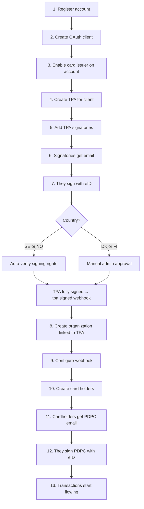

## The hierarchy (memorize this)

```
Account          ← you (the EMS partner)
└── Organization ← your end-client company
    ├── Webhook  ← where events get POSTed
    ├── CardHolder ← employee whose card data you want
    │   └── Card ← actual credit card (managed by issuer)
    │       └── Transaction
    │           └── TransactionState (authorized → cleared → invoiced)
    └── TPA      ← legal agreement (signed by client's authorized signatories)
```

**Account** = your OpenCard partner account. One per EMS.

**Organization** = one of your customers. You set `reference_id` to your internal client ID. Most EMSs map 1:1 (one org per client), but you can split one client into multiple orgs if you need different webhook configs or card type filters.

**Card Holder** = a person. You set `reference_id` to your internal user ID. Two ways to onboard: **email** (user signs with eID) or **`identity_id`** (instant, person already in OpenCard). → [Card Holder Onboarding](/ems/card-holders)

**TPA** (Transaction Processing Authorization) = legal doc the client's signatories sign saying "yes, our card data can flow to this EMS via OpenCard."

**PDPC** (Personal Data Processing Consent) = GDPR consent the individual cardholder signs saying "yes, my transactions can be shared."

## Two legal docs, two audiences

| Doc | Who signs | How | Purpose |
|-----|-----------|-----|---------|
| **TPA** | Company's authorized signatories (CEO, board, etc.) | eID **sign** mode — they sign the actual legal document | Company-level permission |
| **PDPC** | Individual cardholder (employee) | eID **auth** mode — identity verification + consent checkbox | Person-level GDPR consent |

OpenCard handles all of this. For new users you provide an email — we send the link, they sign with BankID/MitID/etc. For users already in OpenCard you pass `identity_id` and skip the wait entirely.

## The full onboarding sequence



## Runtime: what happens on a purchase

1. **Cardholder buys coffee** ☕
2. **Issuer** sends `authorized` transaction state to OpenCard
3. OpenCard normalizes the data, checks org/webhook config
4. **Your webhook** gets `card.transaction.authorized` within seconds
5. If merchant is receipt-enabled → OpenCard requests receipt match
6. 3–5 days later issuer sends `cleared` state
7. Your webhook gets `card.transaction.cleared` — **this is the accounting truth**
8. Maybe `receipt.fetched`, `transaction.true.vat`, `transaction.line_items` follow

## What you build vs what OpenCard builds

| You build | OpenCard builds |
|-----------|-----------------|
| Webhook endpoint + event handlers | Legal signing flows (TPA + PDPC) |
| Org/cardholder CRUD in your UI | eID integration (BankID, MitID, etc.) |
| Map `reference_id` to your DB | Issuer communication |
| Transaction UI in your expense app | Receipt matching orchestration |
| Cancel old issuer integrations | Webhook delivery + retry + logs |

## Reference IDs — your best friend

Every organization and card holder has a `reference_id` **you define**. Put your internal ID there. Every webhook payload includes it. Zero lookup tables needed.

```json
{
  "card_holder": { "reference_id": "user_48291" },
  "organization": { "reference_id": "client_acme_corp" }
}
```

Map straight to your DB. Done. 🎯
