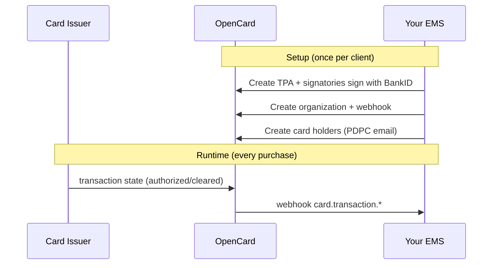

Yo. Welcome to OpenCard. 👋

If you're building an **Expense Management System (EMS)**, you're in the right place. OpenCard is the pipe between card issuers (banks) and your app — transactions, receipts, VAT, line items, environmental impact — pushed to your webhook endpoint as stuff happens.

No polling. No scraping PDFs. No negotiating with 7 different banks.

## Who are you?

Pick your lane:

| You are... | Go here | What you do |
|------------|---------|-------------|
| 🏢 **EMS / expense app** | [Quickstart](/getting-started/quickstart) | Create orgs, card holders, webhooks. Receive transaction events. |
| 💳 **Card issuer / bank** | [Card Issuers](/card-issuers) | POST transaction states when people buy stuff. |
| 🧾 **Receipt provider** | [Receipt Providers](/receipt-providers) | Match receipts to transactions, callback enriched data. |

## The 30-second version

## What you get pushed to your webhook

- `card.transaction.authorized` — purchase just happened ⚡
- `card.transaction.cleared` — settled, use this for accounting ✅
- `card.transaction.deleted` — auth reversed, delete it 🗑️
- `card.transaction.invoiced` — has invoice number 📄
- `receipt.fetched` — digital receipt URL 🧾
- `transaction.true.vat` — correct VAT from merchant 💰
- `transaction.line_items` — what they actually bought 🛒
- `card_holder.*` — lifecycle events for your users 👤
- `tpa.signed` — legal agreement done ✍️

## Environments

| | Sandbox | Production |
|---|---------|------------|
| **API** | `sandbox-api.opencard.io` | `api.opencard.io` |
| **Sign up** | [Register free](https://sandbox-api.opencard.io/register) | Email support@opencard.io |
| **OAuth token** | `https://sandbox-api.opencard.io/oauth/token` | `https://api.opencard.io/oauth/token` |

<Warning>
  Sandbox and production are completely separate. Different OAuth clients, different data, different webhook secrets. Don't mix them.
</Warning>

## Supported countries

OpenCard operates in **4 Nordic countries**: 🇸🇪 Sweden, 🇩🇰 Denmark, 🇳🇴 Norway, 🇫🇮 Finland.

eID signing (BankID, MitID, etc.) works in all four. Org number formats differ per country — see [TPA Flow](/ems/tpa-flow).

## Next step

If you want to ship something today → **[Quickstart](/getting-started/quickstart)**. It's a full walkthrough from register to first webhook, with every API call spelled out.
