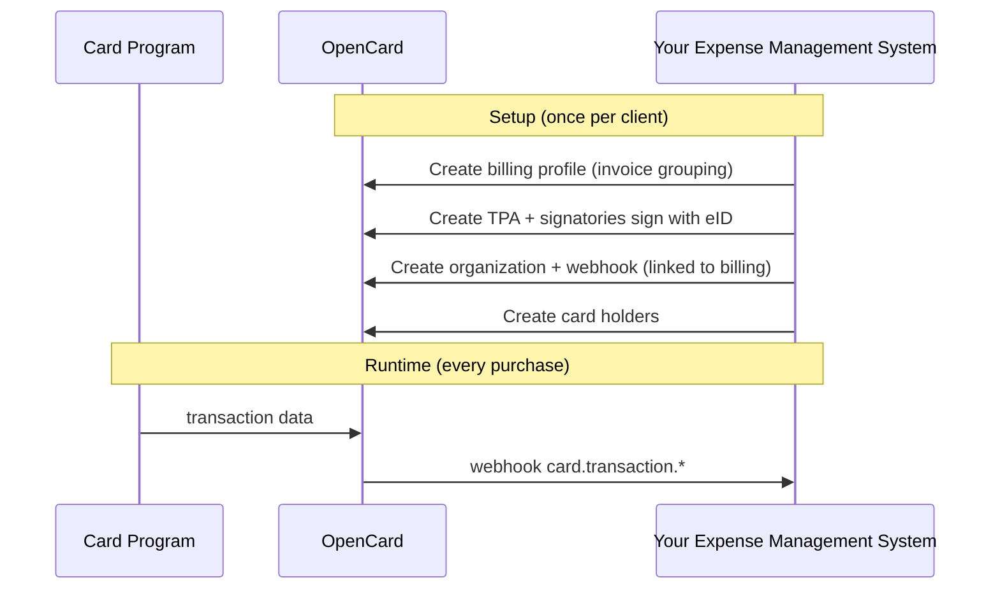

OpenCard is the pipe between card programs and your app — transactions, receipts, VAT, line items, and environmental impact, pushed to your webhook as stuff happens.

No polling. No scraping PDFs.

<CardGroup cols={2}>
  <Card title="Get API access" icon="rocket" href="https://sandbox-api.opencard.io/register">
    Register in sandbox and create your `account_client` credentials.
  </Card>
  <Card title="Quickstart" icon="bolt" href="/getting-started/quickstart">
    Full walkthrough from register to your first webhook event.
  </Card>
</CardGroup>

## Who are you?

| You are... | Go here | What you do |
|------------|---------|-------------|
| 🏢 **Expense Management System** | [Quickstart](/getting-started/quickstart) | Create orgs, card holders, webhooks. Receive transaction events. |
| 💳 **Card issuer / bank** | [Card Issuers](/card-issuers) | Fetch digital receipts via `receipts.opencard.io`. |
| 🧾 **Receipt provider** | [Receipt Providers](/receipt-providers) | Collect receipts, deliver to OpenCard for Expense Management System enrichment. |

## The 30-second version

## What you get pushed to your webhook

- `card.transaction.authorized` — purchase just happened
- `card.transaction.cleared` — settled, use for accounting
- `card.transaction.deleted` — auth reversed
- `card.transaction.invoiced` — has invoice number
- `receipt.fetched` — digital receipt URL
- `transaction.true.vat` — correct VAT from merchant
- `transaction.line.items` — purchase line items
- `card_holder.*` — lifecycle events
- `tpa.signed` — legal agreement done

## Next step

→ **[Quickstart](/getting-started/quickstart)** — full walkthrough from register to first webhook.
