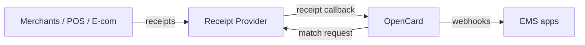

You operate a **receipt collection network**. OpenCard connects your receipts to card transactions and passes enriched data to EMS integrators.

---

## Where you sit

1. You continuously **collect receipts** from merchants in your network
2. OpenCard receives a card transaction marked `receiptable: true`
3. OpenCard sends you the transaction details to match against your receipts
4. When you find a match, you **POST the receipt** to OpenCard
5. OpenCard stores the receipt, extracts VAT + line items
6. EMS apps receive `receipt.fetched`, `transaction.true.vat`, and `transaction.line.items` webhooks

You only integrate with OpenCard — not with EMS apps or card programs.

---

## What you deliver to OpenCard

| You send | OpenCard does | EMS receives |
|----------|---------------|--------------|
| Receipt file (PDF, image, XML) | Stores file, generates URL | `receipt.fetched` |
| VAT breakdown in receipt | Creates TrueVAT records | `transaction.true.vat` |
| Line items in receipt | Creates LineItem records | `transaction.line.items` |

---

## Onboarding checklist

- [ ] Receive **client secret** from OpenCard
- [ ] Endpoint ready to **receive match requests** from OpenCard
- [ ] Implement **outbound callback** to OpenCard (`POST /v1/service/marcet/callback/{referenceId}`)
- [ ] Handle `CallbackRequestResolved` and `CallbackRequestDeleted`
- [ ] Sign every payload with HMAC-SHA256

→ [Callback delivery](/receipt-providers/callback-delivery) for endpoint details.

Contact **support@opencard.io** to get started.
