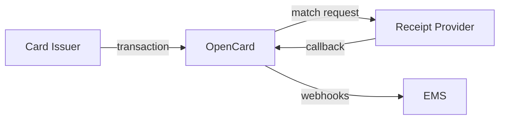

Receipt providers (enrichers) sit between OpenCard and the EMS. You match merchant receipts to card transactions and deliver structured data back.

<Note>
  This is **not** the same as [Digital Receipts for Issuers](/card-issuers/digital-receipts) (`receipts.opencard.io`). That's for card issuers requesting receipts. **You** are the merchant network side — delivering enrichment data **to** OpenCard.
</Note>

---

## Your role

1. OpenCard receives a transaction marked `receiptable: true`
2. OpenCard sends match request to your system (outbound from OpenCard)
3. You find the merchant receipt in your network
4. You **POST callback** to OpenCard with receipt XML/JSON
5. OpenCard extracts VAT + line items, stores receipt
6. EMS gets `receipt.fetched`, `transaction.true.vat`, `transaction.line.items` webhooks

---

## What you deliver

| Data | OpenCard creates | EMS webhook |
|------|------------------|-------------|
| Receipt file (PDF/image) | Stored file + URL | `receipt.fetched` |
| True VAT breakdown | TrueVAT records | `transaction.true.vat` |
| Line items | LineItem records | `transaction.line.items` |

---

## Onboarding checklist

- [ ] Receive shared **client secret** from OpenCard
- [ ] Implement callback endpoint readiness (OpenCard POSTs **to** you for match requests)
- [ ] Implement **inbound callback** to OpenCard (`POST /v1/service/marcet/callback/{referenceId}`)
- [ ] Handle `CallbackRequestResolved` and `CallbackRequestDeleted` events
- [ ] Sign payloads with HMAC-SHA256

→ [Callback Delivery](/receipt-providers/callback-delivery) for the inbound API.

Contact **support@opencard.io** to become a receipt provider partner.
