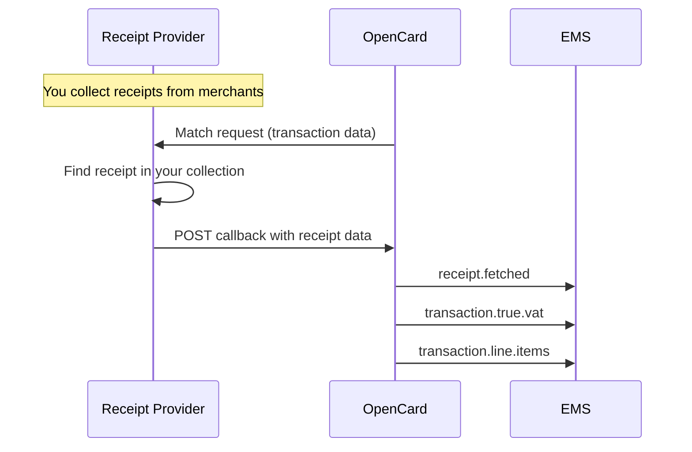

Receipt providers are actors that **collect digital receipts** — from merchants, POS systems, e-commerce platforms, or your own network — and **deliver them to OpenCard**.

OpenCard attaches the receipt to the matching card transaction, extracts VAT and line items, and forwards everything to EMS apps via webhooks.

---

## The flow



Your job ends at the callback to OpenCard. You never talk to EMS apps directly.

---

## What you implement

1. **Collect receipts** in your merchant network
2. **Receive match requests** from OpenCard when a transaction is receiptable
3. **POST the receipt** back to OpenCard when you have a match

→ [How it works](/receipt-providers/how-it-works) · [Callback delivery](/receipt-providers/callback-delivery) · [Payload formats](/receipt-providers/payload-formats)

---

## Auth

Callbacks to OpenCard are authenticated with **HMAC-SHA256**:

```
X-Data-Signature: HMAC-SHA256(raw_request_body, shared_client_secret)
```

You receive the shared secret from OpenCard during onboarding.

---

## Events

| `X-Event` header | Meaning |
|------------------|---------|
| `CallbackRequestResolved` | Receipt found — send receipt payload |
| `CallbackRequestDeleted` | No match / expired — send empty body |

Contact **support@opencard.io** to become a receipt provider partner.
