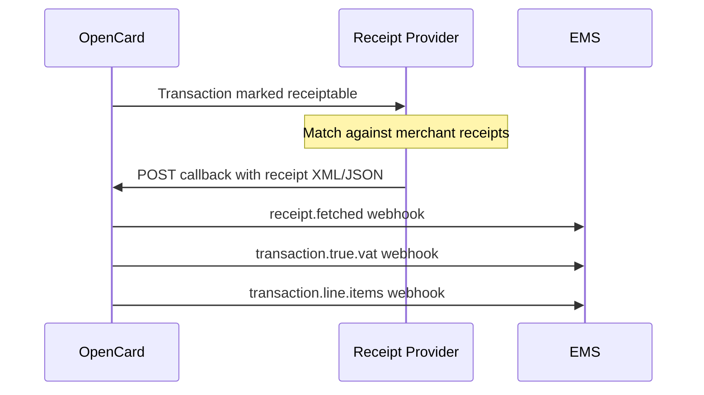

Receipt providers (enrichers) match card transactions to merchant digital receipts and callback enriched data to OpenCard.

OpenCard then fires `receipt.fetched`, `transaction.true.vat`, and `transaction.line.items` webhooks to the EMS.

---

## The flow



---

## Two different "receipt" integrations

| Role | API | You are |
|------|-----|---------|
| **Receipt Provider** (this section) | Callback to `api.opencard.io` | Merchant network / enricher |
| **Card Issuer — Digital Receipts** | `receipts.opencard.io` | Bank requesting receipts for cardholders |

If you're a **card issuer** wanting digital receipts for your app → [Digital Receipts](/card-issuers/digital-receipts), not this section.

---

## What you implement

1. Receive transaction data from OpenCard (outbound to your system)
2. Match against your merchant receipt database
3. **POST callback** to OpenCard when matched

→ [How it works](/receipt-providers/how-it-works) · [Callback Delivery](/receipt-providers/callback-delivery) · [Payload formats](/receipt-providers/payload-formats)

---

## Auth

Callbacks authenticated via **HMAC-SHA256**:

```
X-Data-Signature: HMAC-SHA256(raw_request_body, shared_client_secret)
```

Shared secret provisioned by OpenCard during onboarding.

---

## Events

| `X-Event` header | Meaning |
|------------------|---------|
| `CallbackRequestResolved` | Receipt matched, payload contains receipt data |
| `CallbackRequestDeleted` | Match cancelled/expired |

Contact **support@opencard.io** for provider onboarding.
